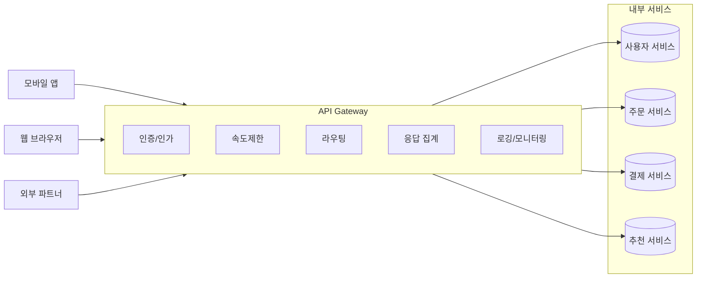
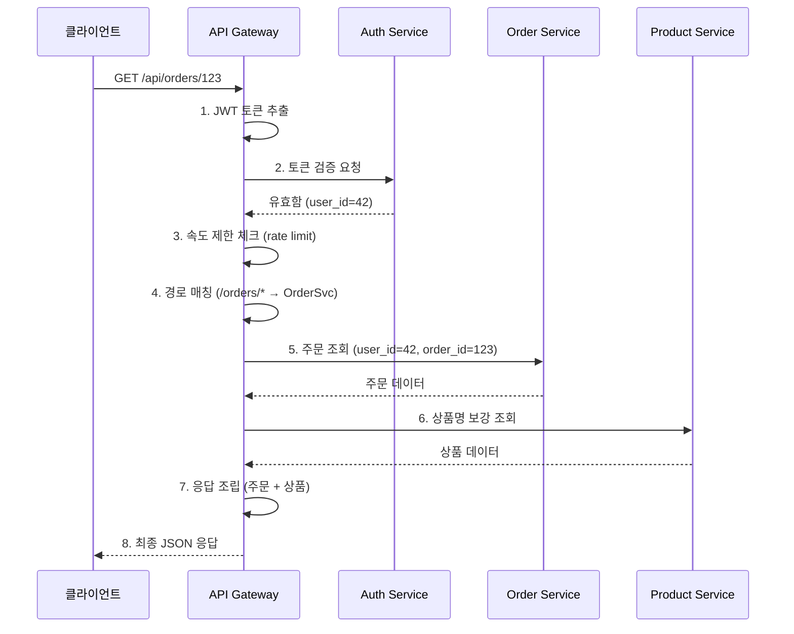
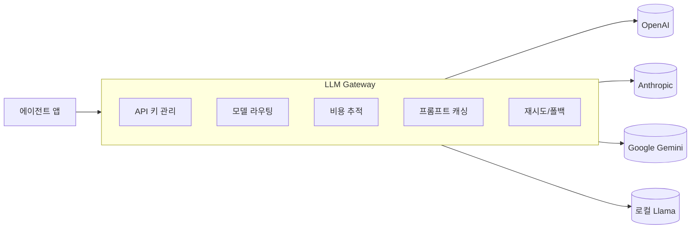
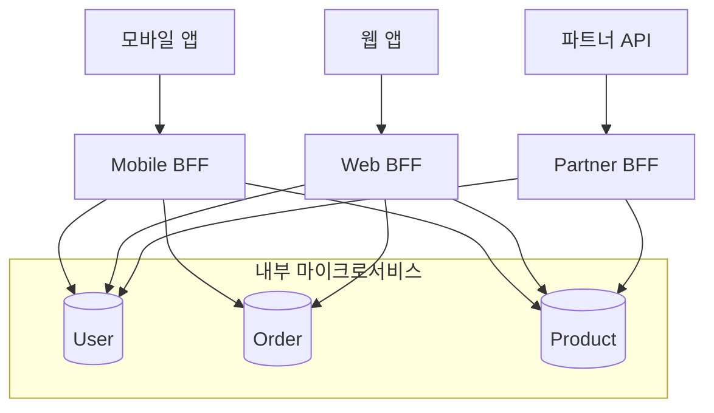

---
생성날짜:
- 2026-04-21 15:00
마지막수정날짜:
- 2026-04-21-화요일 15:00
tags:
- 설계원칙
- 아키텍처패턴
- API Gateway
- 마이크로서비스
- AI에이전트
별칭:
- API Gateway
- API 게이트웨이
- 게이트웨이 패턴
type:
- 자료수집
Area/Reasource:
Project:
---
# API Gateway 패턴

**"외부에서 들어오는 모든 요청을 단 하나의 입구에서 받아 적절한 내부 서비스로 라우팅하는 아키텍처 패턴."**

API Gateway(API 게이트웨이, 외부 클라이언트와 내부 서비스군 사이에 위치하는 전용 진입점 서버)는 마이크로서비스(Microservices, 독립적으로 배포 가능한 작은 서비스들의 집합) 앞단에 세우는 중계 계층이다. 공항 입국 심사대를 생각하면 된다. 승객(클라이언트)은 한 곳에 줄 서서 여권 확인, 세관 검사, 목적지 터미널 안내까지 한 번에 받고 각자 게이트로 흩어진다.

## 한눈에 보기

| 항목 | 내용 |
| --- | --- |
| 분류 | 아키텍처 패턴(Architectural) |
| 목적 | 여러 백엔드 서비스를 단일 엔드포인트로 노출, 공통 관심사 중앙화 |
| 핵심 책임 | 라우팅, 인증, 속도제한, 응답 집계, 프로토콜 변환 |
| 대표 구현 | AWS API Gateway, Kong, NGINX, Azure API Management, Envoy |
| 관련 패턴 | [[Facade 패턴]]의 분산 시스템 버전, BFF(Backend for Frontend) |
| 포함 관계 | [[#Microservices vs Monolith\|Microservices]] 아키텍처의 필수 요소로 자주 쓰임 |

> **한마디 요약**: "여러 서비스 앞에 세우는 단일 창구. 라우팅 + 공통 처리 + 집계를 한 곳에서."

---

## 일상 비유: 호텔 프런트 데스크

5성급 호텔에 체크인하는 순간을 떠올려본다. 투숙객은 객실, 레스토랑, 스파, 주차장을 각각 찾아다닐 필요 없다. 프런트 데스크(Gateway) 한 곳에서 신분 확인(인증), VIP 여부 체크(권한), 예약 확인(라우팅), 조식 쿠폰 발급(응답 집계)까지 해결한다. 내부 부서(서비스)들은 자기 일만 잘하면 되고, 프런트가 조율한다.

---

## 구조



클라이언트는 Gateway 하나만 바라보고, Gateway가 뒷단의 여러 서비스로 요청을 분배한다.

---

## 단계 분해: 요청이 처리되는 흐름



1단계 → 2단계 → 3단계로 쪼개면: **토큰 검증 → 권한 확인 → 속도 제한 검사 → 라우팅 → 백엔드 호출 → 응답 가공 → 클라이언트 반환**.

---

## Gateway가 짊어지는 공통 관심사(Cross-Cutting Concerns)

| 책임 | 설명 | 왜 Gateway에 두는가 |
| --- | --- | --- |
| 인증/인가 | JWT(JSON Web Token, 서명된 토큰 문자열) 검증, OAuth2 처리 | 각 서비스에 중복 구현 방지 |
| 속도 제한 | IP/사용자별 초당 요청 수 제한 | 단일 지점에서 트래픽 보호 |
| SSL 종단 | HTTPS 복호화를 Gateway에서 끝냄 | 내부 서비스는 평문 HTTP로 속도 확보 |
| 로깅/추적 | 모든 요청을 한 곳에서 기록 | 관측(Observability) 일원화 |
| 프로토콜 변환 | 외부 REST ↔ 내부 gRPC | 내부 최적화와 외부 호환성 분리 |
| 응답 집계 | 여러 서비스 호출 결과를 합침 | 클라이언트 왕복 횟수 축소 |
| 캐싱 | 자주 조회되는 응답 저장 | 백엔드 부하 감소 |

---

## 나쁜 예 vs 좋은 예

### 나쁜 예: Gateway 없이 클라이언트가 직접 호출

```
[모바일 앱] ──┬──▶ [User Service    : auth.company.com]
              ├──▶ [Order Service   : order.company.com]
              ├──▶ [Product Service : product.company.com]
              └──▶ [Payment Service : pay.company.com]
```

문제:
- 클라이언트가 모든 서비스 주소를 알아야 함(결합도 폭발)
- 인증 로직이 각 서비스에 중복됨
- 모바일 한 화면에 4번 호출 → 네트워크 왕복 증가
- 서비스 주소 변경 시 클라이언트 업데이트 배포 필요

### 좋은 예: API Gateway 중계

```
[모바일 앱] ──▶ [API Gateway : api.company.com] ──┬──▶ User Service
                                                   ├──▶ Order Service
                                                   ├──▶ Product Service
                                                   └──▶ Payment Service
```

장점:
- 클라이언트는 `api.company.com` 하나만 안다
- 인증/로깅은 Gateway에서 한 번만
- 모바일용 화면은 `/mobile/home` 엔드포인트에서 집계해서 한 번에 반환
- 내부 서비스 주소 바뀌어도 클라이언트 영향 없음

---

## AI 에이전트 개발에서의 적용

LLM(Large Language Model, 대규모 언어 모델) 기반 에이전트 시스템에서도 Gateway 패턴이 자주 등장한다. 여러 모델 공급자(OpenAI, Anthropic, Google)를 동시에 붙여두고 한 입구에서 라우팅하는 **LLM Gateway** 가 대표적임.



LiteLLM, OpenRouter, Portkey 같은 도구들이 이 역할을 한다. 장점은 이렇게 쪼갤 수 있음.

- **벤더 락인(Vendor Lock-in, 특정 공급자 의존) 회피**: 앱 코드는 그대로 두고 공급자만 교체
- **비용 최적화**: 간단한 질문은 저렴한 모델, 복잡한 추론은 고성능 모델로 라우팅
- **장애 폴백(Fallback, 대체 경로)**: OpenAI 다운 시 Anthropic으로 자동 전환
- **프롬프트 캐싱 중앙화**: 동일 질문 결과 재사용

```python
# 예: LiteLLM proxy 앞에 에이전트를 둔 구조
import openai

client = openai.OpenAI(
    base_url="http://llm-gateway.internal/v1",  # Gateway 주소
    api_key="dummy",
)

# 모델 이름으로 라우팅 (Gateway가 실제 공급자 결정)
response = client.chat.completions.create(
    model="smart-tier",  # Gateway가 claude-opus로 매핑
    messages=[{"role": "user", "content": question}],
)
```

---

## Backend for Frontend (BFF) 변형

클라이언트 종류별로 Gateway를 따로 두는 변형을 **BFF(Backend for Frontend, 프론트엔드 전용 백엔드)** 라고 부른다. Sam Newman이 정리한 패턴임.



**왜 나누는가?**: 모바일은 데이터 용량이 중요하고, 웹은 풍부한 정보가 필요하고, 파트너는 계약 기반 규격을 원한다. 하나의 Gateway로 모두 만족시키려다 보면 엔드포인트가 비대해짐. 화면 단위로 Gateway를 쪼개는 게 BFF 취지다.

---

## 트레이드오프

| 장점 | 단점 |
| --- | --- |
| 클라이언트-서비스 결합도 감소 | Gateway가 단일 장애점(SPOF)이 됨 |
| 공통 관심사 중앙화 | 추가 네트워크 홉으로 지연시간 증가 |
| 내부 서비스 리팩토링 자유도 확보 | Gateway 자체가 복잡해지면 병목 |
| 보안 경계 명확 | 개발/운영 복잡도 추가 |
| 응답 집계로 왕복 횟수 감소 | Gateway 팀과 서비스 팀 간 조율 필요 |

> SPOF(Single Point of Failure, 단일 장애점) 문제는 Gateway 자체를 다중 인스턴스 + 로드밸런서 뒤에 두는 걸로 대응함. AWS API Gateway 같은 관리형 서비스는 이미 다중 AZ로 분산 구성되어 있다.

---

## 언제 쓰면 좋은가

1. **서비스가 5개 이상** 이고 클라이언트가 여러 개를 엮어 써야 할 때
2. **인증/로깅/속도제한 같은 공통 관심사** 를 매 서비스마다 반복 구현하기 싫을 때
3. **모바일 등 왕복 비용이 큰 클라이언트** 를 지원해야 할 때(응답 집계 필요)
4. **내부 서비스 주소/프로토콜을 외부에 노출하고 싶지 않을 때**
5. **멀티 LLM 공급자** 를 다루는 AI 에이전트 시스템

반대로 서비스가 1~2개뿐인 소규모 시스템에 Gateway를 세우는 건 과잉 설계에 가깝다.

---

## 직접 확인하기

1. 로컬에 NGINX 하나 띄우고 `proxy_pass` 로 2개 서비스로 라우팅 실험
2. 공식 NGINX 예제 참고:

```nginx
server {
    listen 80;
    server_name api.local;

    location /users/ {
        proxy_pass http://localhost:3001;
    }
    location /orders/ {
        proxy_pass http://localhost:3002;
    }
}
```

3. `curl -v http://api.local/users/1` 로 라우팅 동작 관찰
4. 같은 요청에 `Authorization` 헤더 검증 추가해보기(NGINX `auth_request` 모듈)

출처: [Microsoft Architecture Center - Gateway Routing](https://github.com/microsoftdocs/architecture-center/blob/main/docs/patterns/gateway-routing-content.md)

---

## 다른 패턴과의 관계 (포함 관계)

- **[[Facade 패턴]]의 분산 확장**: Facade가 클래스 레벨 창구라면, API Gateway는 서비스 레벨 창구
- **[[Microservices vs Monolith|Microservices]]의 파트너 패턴**: 마이크로서비스를 쓰면 Gateway는 거의 필수
- **[[Proxy 패턴(대리 처리)|Proxy]]의 확장**: 단순 대리 호출을 넘어 집계/변환까지 수행
- **[[Mediator 패턴(중재자)|Mediator]]와 유사**: 여러 객체/서비스 간 중재 역할
- **[[MVC 패턴|MVC]]의 Controller 역할을 서비스 계층에서 수행**: 외부 요청을 내부 로직으로 연결

---

## 요약

> **"여러 마이크로서비스를 한 주소로 묶는 단일 창구. 라우팅과 공통 관심사(인증/로깅/캐싱/집계)를 Gateway 하나에 몰아 클라이언트와 서비스 양쪽을 단순하게 만드는 것이 목적."**

관련 문서:
- [[Microservices vs Monolith]]
- [[CQRS 패턴]]
- [[MVC 패턴]]
- [[Facade 패턴]]
