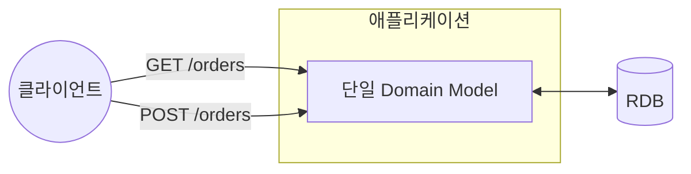
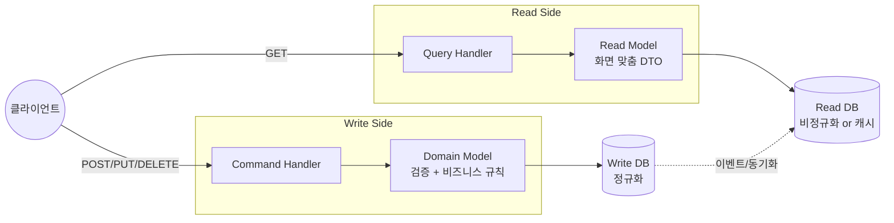
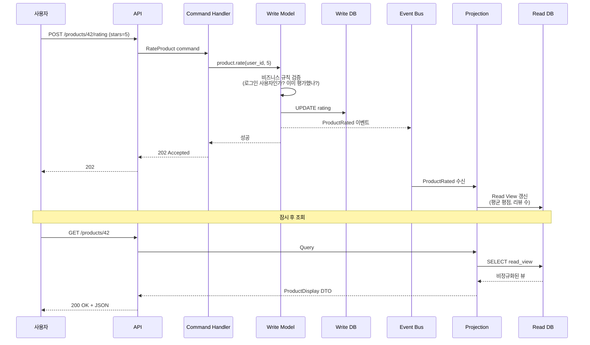
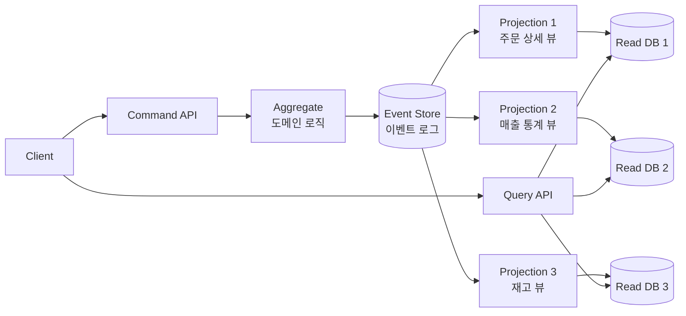
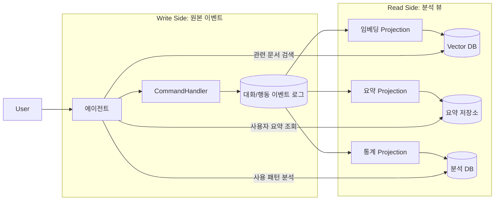

---
생성날짜:
- 2026-04-21 15:30
마지막수정날짜:
- 2026-04-21-화요일 15:30
tags:
- 설계원칙
- 아키텍처패턴
- CQRS
- 이벤트소싱
- AI에이전트
별칭:
- CQRS
- Command Query Responsibility Segregation
- 명령 조회 책임 분리
type:
- 자료수집
Area/Reasource:
Project:
---
# CQRS 패턴

**"데이터를 바꾸는 경로(Command, 쓰기)와 데이터를 읽는 경로(Query, 조회)를 완전히 다른 모델/코드/때로는 DB로 분리하는 패턴."**

CQRS(Command Query Responsibility Segregation, 커맨드-쿼리 책임 분리, Greg Young이 2010년대 초 정리한 아키텍처 패턴)는 한 모델로 읽기와 쓰기를 다 처리하던 관행을 깨고, 두 책임을 완전히 쪼개자는 아이디어다. 슈퍼마켓의 계산대(쓰기, 재고 감소)와 상품 진열대(읽기, 빠른 조회)를 분리한 것과 같다.

## 한눈에 보기

| 항목 | 내용 |
| --- | --- |
| 분류 | 아키텍처 패턴(데이터 흐름 분리) |
| 기반 원칙 | Bertrand Meyer의 CQS(Command Query Separation): "함수는 값을 바꾸거나 돌려주거나, 둘 중 하나만 해라" |
| 핵심 아이디어 | 쓰기 모델(Write Model)과 읽기 모델(Read Model)을 독립 설계 |
| 자주 짝꿍 | Event Sourcing, DDD(Domain-Driven Design), [[#Microservices vs Monolith\|Microservices]] |
| 해결 문제 | 복잡한 도메인에서 읽기/쓰기 요구가 완전히 달라 한 모델로 둘 다 만족시키기 힘든 상황 |
| 포함 관계 | [[#Microservices vs Monolith\|Microservices]]에서 특히 자주 쓰임, Event Sourcing과 함께 쓰면 시너지 |

> **한마디 요약**: "쓰기는 쓰기답게, 읽기는 읽기답게. 두 세계를 분리해서 각자 최적화하라."

---

## 일상 비유: 은행 창구 vs ATM

은행에서 입출금(쓰기, 계좌 잔액 변경) 은 창구 직원이 신분증 확인하고 서명 받고 꼼꼼히 처리한다. 잔액 조회(읽기)는 ATM, 앱, 창구 어디서든 빠르게 가능하다. 두 작업의 **요구사항이 완전히 다르다**. 쓰기는 정확성과 일관성, 읽기는 속도와 접근성이 중요하다. 같은 창구 직원에게 둘 다 시키면 양쪽 다 비효율적.

---

## 구조

### 전통적 CRUD (한 모델)



읽기와 쓰기가 같은 모델, 같은 테이블을 쓴다.

### CQRS (모델 분리)



쓰기 쪽은 도메인 규칙을 꼼꼼히 검증하고, 읽기 쪽은 화면에 맞춰 비정규화된 데이터를 빠르게 반환한다.

---

## 용어 풀이

| 용어 | 뜻 |
| --- | --- |
| Command | "주문을 생성하라", "상품 평점을 매겨라" 같은 **상태 변경 명령**. 반환값 없음(또는 성공/실패만) |
| Query | "상품 상세를 보여달라", "내 주문 목록을 달라" 같은 **조회 요청**. 상태 변경 없음 |
| Write Model | Command를 처리하는 도메인 모델. 비즈니스 규칙, 일관성 검사 수행 |
| Read Model | Query 응답 전용 모델. 화면/API 응답에 딱 맞는 구조. DTO(Data Transfer Object)에 가까움 |
| Event | Write Model에서 상태가 바뀌면 발행. Read Model 갱신에 사용 |

---

## 단계 분해: 상품 평점 등록 흐름



1단계: 사용자가 쓰기 요청 → 2단계: Command Handler가 비즈니스 규칙 검증 → 3단계: Write DB에 저장 → 4단계: 이벤트 발행 → 5단계: Projection(투영, 이벤트를 읽기 전용 뷰로 변환하는 처리)이 Read DB 갱신 → 6단계: 사용자가 읽기 요청 → 7단계: Read DB에서 빠르게 반환.

---

## 코드 예시 (C#, Microsoft 공식 문서 기반)

출처: [Microsoft Architecture Center - CQRS](https://github.com/microsoftdocs/architecture-center/blob/main/docs/patterns/cqrs.md)

### Write Side: Command 정의

```csharp
public interface ICommand
{
    Guid Id { get; }
}

public class RateProduct : ICommand
{
    public RateProduct()
    {
        this.Id = Guid.NewGuid();
    }
    public Guid Id { get; set; }
    public int ProductId { get; set; }
    public int Rating { get; set; }
    public int UserId { get; set; }
}
```

### Write Side: Command Handler

```csharp
public class ProductsCommandHandler :
    ICommandHandler<AddNewProduct>,
    ICommandHandler<RateProduct>
{
    private readonly IRepository<Product> repository;

    public ProductsCommandHandler(IRepository<Product> repository)
    {
        this.repository = repository;
    }

    void Handle(RateProduct command)
    {
        var product = repository.Find(command.ProductId);
        if (product != null)
        {
            product.RateProduct(command.UserId, command.Rating);
            repository.Save(product);
        }
    }
}
```

### Read Side: Read Model

```csharp
namespace ReadModel
{
    public interface ProductsDao
    {
        ProductDisplay FindById(int productId);
        ICollection<ProductDisplay> FindByName(string name);
        ICollection<ProductInventory> FindOutOfStockProducts();
    }

    public class ProductDisplay
    {
        public int Id { get; set; }
        public string Name { get; set; }
        public string Description { get; set; }
        public decimal UnitPrice { get; set; }
        public bool IsOutOfStock { get; set; }
        public double UserRating { get; set; }  // 화면 전용 집계값
    }
}
```

**핵심**: Write Model의 `Product` 는 복잡한 도메인 객체지만, Read Model의 `ProductDisplay` 는 단순 DTO다. 화면에 필요한 것만 미리 조립해 둠.

---

## 나쁜 예 vs 좋은 예

### 나쁜 예: 한 모델로 다 하려다 비대해진 엔티티

```python
class Product:
    # 쓰기용 필드
    id: int
    stock: int
    price: Decimal
    rating_sum: int
    rating_count: int

    # 읽기용 파생 필드 (쿼리 시마다 계산)
    @property
    def average_rating(self) -> float:
        return self.rating_sum / self.rating_count if self.rating_count else 0

    # 쓰기용 메서드
    def rate(self, user_id, stars):
        # 중복 평가 검증, 권한 체크 등
        ...

    # 읽기 전용 검색 메서드 (여기 왜 있지?)
    @classmethod
    def search_by_name(cls, keyword) -> list:
        ...

    # 관리자용 통계 메서드 (여기도 왜 있지?)
    @classmethod
    def top_rated_this_week(cls) -> list:
        ...
```

문제:
- 하나의 `Product` 클래스가 도메인 규칙, 화면 렌더링, 검색, 통계를 전부 책임
- 검색 성능을 위해 읽기 쪽에 인덱스/비정규화를 하고 싶어도 쓰기 로직과 얽혀 변경이 어려움
- 쓰기 트래픽이 몰리면 읽기까지 느려짐

### 좋은 예: CQRS로 분리

- **쓰기 쪽**: `Product` 도메인 객체는 비즈니스 규칙에만 집중
- **읽기 쪽**: `ProductSearchView`, `ProductDetailView`, `TopRatedView` 등 **용도별 뷰**를 따로 관리
- 읽기 DB는 Elasticsearch, 쓰기 DB는 PostgreSQL 같이 기술 스택도 다르게 선택 가능

---

## CQRS + Event Sourcing 조합

Event Sourcing(이벤트 소싱, 현재 상태 대신 이벤트 시퀀스를 저장소에 쌓아두는 방식)과 함께 쓰면 CQRS의 위력이 극대화된다.



**장점**:
- 이벤트 로그로 과거 어느 시점 상태도 재구성 가능(감사/디버깅)
- 새 화면 요구 발생하면 새 Projection을 추가하면 됨(기존 코드 손대지 않음)
- 이벤트를 다른 서비스도 구독 가능(느슨한 결합)

---

## AI 에이전트 개발에서의 CQRS

LLM 기반 에이전트 시스템에서도 CQRS가 유용한 지점이 있다.

**예시**: 대화 에이전트가 사용자 행동 로그를 바탕으로 추천/분석을 생성한다고 하자.



**왜 유용한가**:
- 사용자 메시지 원본은 한 번만 저장(쓰기 경로 단순)
- 임베딩/요약/통계 같은 여러 파생 뷰는 비동기로 갱신
- 새로운 뷰(예: "감정 분석") 추가 시 기존 파이프라인 건드리지 않고 Projection만 추가
- 파생 계산이 오래 걸려도 쓰기 응답 시간에 영향 없음

---

## 언제 쓰면 좋은가 / 피해야 할 때

### 적합한 경우

1. **읽기와 쓰기 비율이 극단적으로 치우침**: 읽기 100 : 쓰기 1 같은 상황(콘텐츠 서비스, 상품 카탈로그)
2. **복잡한 도메인 규칙**: 쓰기 시 검증·계산이 많아 읽기 응답 속도에 악영향
3. **화면마다 다른 뷰가 필요**: 모바일, 대시보드, 리포트가 각각 다른 집계 필요
4. **[[Microservices vs Monolith|Microservices]] + 이벤트 기반 아키텍처** 를 이미 쓰고 있을 때
5. **감사/이력 추적**: 누가 언제 뭘 했는지 완벽히 남겨야 하는 금융/의료 시스템

### 피해야 할 때

1. **단순 CRUD(Create-Read-Update-Delete) 앱**: 과잉 설계
2. **소규모 팀/앱**: 복잡도 대비 이득 없음
3. **강한 일관성이 필수**: 읽기가 항상 최신이어야 한다면 Eventual Consistency가 걸림돌
4. **이벤트 기반 인프라가 없을 때**: 메시지 브로커 없이 CQRS는 구현 난도 급상승

> **Microsoft 공식 가이드 인용**: "CQRS는 시스템의 일부 영역에만 선택적으로 적용해야 한다. 앱 전체에 적용하면 대부분 복잡도만 증가한다."

---

## 트레이드오프

| 장점 | 단점 |
| --- | --- |
| 읽기/쓰기 각각 최적화 가능 | 복잡도 큰 폭으로 증가 |
| 읽기 쪽만 스케일 아웃 가능 | 두 모델을 동기화해야 함 |
| 복잡 도메인을 깔끔히 표현 | Eventual Consistency로 "방금 쓴 게 바로 안 보임" 가능 |
| 새 읽기 뷰 추가가 쉬움 | 학습 곡선 가파름 |
| 감사/이력 자연스럽게 확보(Event Sourcing 결합) | 개발자 수 대비 유지비용 큼 |

---

## Eventual Consistency 주의

CQRS에서 Write DB → Read DB 동기화는 비동기인 경우가 많다. 사용자가 상품 평점을 5점 주고 바로 새로고침하면 평균 평점이 아직 안 바뀌어 있을 수 있음.

**대응 전략**:
- UI에서 낙관적 업데이트(Optimistic UI, 서버 응답 전 화면에 반영) 처리
- "처리 중" 상태 표시
- 중요한 조회는 Write DB를 직접 쳐 읽기(Strong Consistency가 필요한 경우만)

---

## 직접 확인하기

1. Microsoft 공식 CQRS 문서 읽기: [CQRS Pattern](https://learn.microsoft.com/en-us/azure/architecture/patterns/cqrs)
2. 자기 서비스에서 "읽기 쿼리 수 / 쓰기 쿼리 수" 비율 측정, 100 : 1 이상이면 CQRS 후보
3. 도메인 모델에 `search_*`, `top_*`, `statistics_*` 같은 읽기 전용 메서드가 몇 개 있는지 세기
4. 가장 복잡한 Aggregate 하나만 골라 Read Model을 별도 DTO로 분리해보는 작은 실험부터 시작

---

## 다른 패턴과의 관계 (포함 관계)

- **CQS의 아키텍처 확장판**: 함수 레벨 분리였던 CQS를 시스템 레벨로 끌어올린 것
- **Event Sourcing과 시너지**: 이벤트 로그가 Write Store, Projection이 Read Store 역할
- **[[Microservices vs Monolith|Microservices]]에서 자주 쓰임**: 서비스별로 읽기/쓰기 분리
- **[[API Gateway 패턴]]과 조합**: Gateway에서 Command와 Query 엔드포인트를 분기
- **[[MVC 패턴]]의 연장선**: Controller가 Command/Query를 각각 다른 핸들러로 위임
- **[[Observer 패턴]]의 분산 버전**: Event Bus가 여러 Projection에 통지하는 구조

---

## 요약

> **"쓰기(Command)와 읽기(Query)를 서로 다른 모델·코드·때로는 DB로 분리해 각자 최적화하는 패턴. 복잡한 도메인, 읽기/쓰기 비대칭, 이벤트 기반 시스템에서 빛난다. 단순 CRUD에는 과잉 설계임을 항상 경계."**

관련 문서:
- [[Microservices vs Monolith]]
- [[API Gateway 패턴]]
- [[MVC 패턴]]
- [[Observer 패턴]]
- [[SOLID원칙]]
