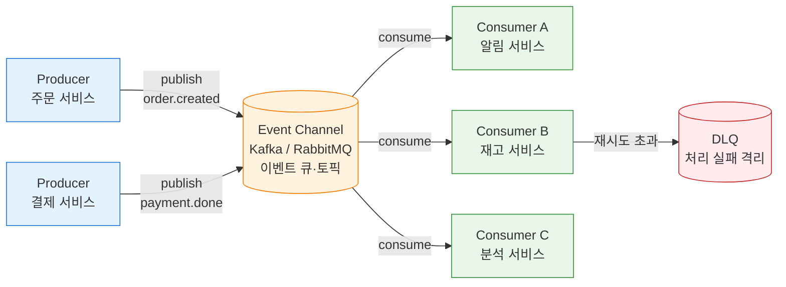
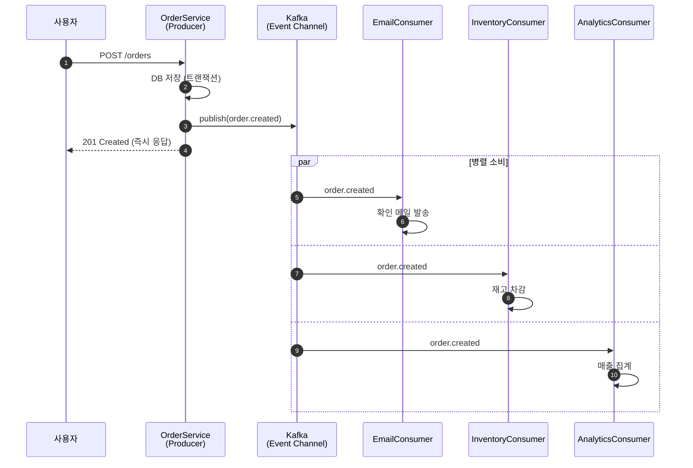

---
생성날짜:
- 2026-04-21 12:15
마지막수정날짜:
- 2026-04-21-화요일 12:15
tags:
- 설계원칙
- 아키텍처패턴
- 이벤트드리븐
- EDA
- AI에이전트
- 비동기
별칭:
- Event-Driven
- EDA
- 이벤트 기반 아키텍처
- 이벤트 드리븐
type:
- 자료수집
Area/Reasource:
Project:
---
# Event-Driven 아키텍처란?

Event-Driven Architecture(EDA, 이벤트 드리븐 아키텍처, 이벤트 기반 아키텍처, "어떤 일이 일어났다"는 사실(이벤트)을 중심으로 컴포넌트들이 느슨하게 연결되어 반응하는 구조)는 **"시스템이 요청하지 않고 사건에 반응한다"** 는 원리로 돌아가는 아키텍처 스타일이다.

명령형 호출(`A.call(B)`) 대신 **"이 일이 일어났어요"** 를 선언적으로 발행(publish)하면, 관심 있는 쪽이 알아서 소비(consume)해서 처리함.

## 한눈에 보기

| 항목      | 내용                                                |
| ------- | ------------------------------------------------- |
| 분류      | 아키텍처 스타일(Architectural Style)                     |
| 한 줄 정의  | 이벤트 발생 시 등록된 소비자가 반응하여 동작하는 비동기·분산 구조             |
| 핵심 구성   | Event Producer, Event Channel(큐/버스), Event Consumer |
| 해결 문제   | 강결합, 동기 호출 체인, 확장성 병목, 실시간 반응                     |
| 관련 원칙   | 느슨한 결합, 비동기, 단일 책임(SRP)                           |
| 대표 기술   | Kafka, RabbitMQ, AWS EventBridge, Redis Streams, NATS |

> **한마디 요약**: "사건이 일어나면 그 사실만 던진다. 누가 듣고 뭘 할지는 듣는 쪽 마음."

---

## 일상 비유

**화재 경보기와 소방서, 관리실, 주민**의 관계를 떠올리면 된다.

1. 연기 감지기(Producer)가 "연기 감지됨" 이벤트를 울린다
2. 경보음이 건물 방송 시스템(Event Channel)을 통해 퍼진다
3. 소방서, 건물 관리실, 주민(Consumer)이 각자 알아서 행동한다 (신고, 출동, 대피)

감지기는 누가 들을지 신경 쓰지 않음. 듣는 쪽은 자기가 뭘 할지만 안다. 이게 Event-Driven의 본질임.

다른 비유:
- 증권거래소(거래 체결 이벤트가 발생하면 시세판, 호가창, 체결 내역 DB, 알람 시스템이 각자 반응)
- 택배 송장 시스템(상태 변경 이벤트가 발행자 허브 스캔 시 발행되면 고객 앱 알림, 창고 시스템, 정산 시스템 등이 구독)
- 이메일(받는 사람에 따라 스팸함/중요/일반함으로 자동 분류되는 필터 규칙)

---

## 구조



- **Producer(프로듀서, 발행자)**: 이벤트를 만드는 쪽. 누가 받을지 모름
- **Event Channel(이벤트 채널, 메시지 브로커)**: 이벤트를 일시 보관·전달하는 중계소. Kafka, RabbitMQ 같은 것들
- **Consumer(컨슈머, 소비자, 구독자)**: 이벤트를 받아 처리하는 쪽
- **Event(이벤트)**: "과거에 일어난 불변 사실"을 표현하는 메시지. `OrderCreated`, `PaymentFailed` 같이 과거형 이름이 관례임

### 이벤트 흐름 시퀀스



---

## 이벤트의 두 가지 의미

실무에서 "이벤트"라는 단어는 두 가지 뉘앙스로 쓰임. 혼동하면 설계가 꼬인다.

| 종류             | 의미                             | 예시                                   |
| -------------- | ------------------------------ | ------------------------------------ |
| **Event Notification** | "X가 일어났다. 자세한 건 알아서 조회해라" | `OrderCreated{orderId: "O-1"}`       |
| **Event-Carried State** | 이벤트에 필요한 상태 전체를 실어 보냄        | `OrderCreated{id, items, total, ...}` |

- Notification은 가볍고 느슨하지만 Consumer가 다시 조회(query)해야 함
- State-Carried는 Consumer가 자기 데이터만으로 처리 가능하지만 스키마 의존성이 생김

---

## 동기 호출 vs Event-Driven

| 관점        | 동기 호출(REST, RPC)           | Event-Driven                              |
| --------- | ------------------------- | ----------------------------------------- |
| 결합도       | 강함 (호출자가 수신자 주소를 앎)       | 약함 (발행자는 채널만 앎)                           |
| 대기 여부     | 응답 올 때까지 블로킹              | 비동기, fire-and-forget                      |
| 장애 전파     | 수신자 장애가 호출자에 즉시 영향        | 큐가 흡수, Retry/DLQ로 격리 가능                   |
| 확장성       | 호출자가 수신자 수를 앎, 추가 시 수정 필요 | 새 Consumer 추가는 구독만 등록                     |
| 순서 보장     | 자연스러움                     | 파티션/키 설계 필요                               |
| 디버깅       | 스택 트레이스로 추적 쉬움            | 분산 트레이싱(OpenTelemetry) 없으면 추적 괴로움 |

---

## 나쁜 예 vs 좋은 예 (Python)

### 나쁜 예: 직접 호출 체인

```python
class OrderService:
    def __init__(self):
        self.email = EmailService()
        self.inventory = InventoryService()
        self.analytics = AnalyticsService()
        self.shipping = ShippingService()

    def create_order(self, order):
        self._save(order)
        self.email.send_confirmation(order)
        self.inventory.reserve(order)
        self.analytics.record(order)
        self.shipping.schedule(order)
```

문제:
- Email 서버가 죽으면 주문 자체가 실패함(장애 전파)
- 새 소비자(로얄티 적립) 추가 시 `OrderService` 수정 필요(OCP 위반)
- 4개 서비스 응답을 다 기다려야 주문 응답이 나감(지연 누적)

### 좋은 예: 이벤트 발행

```python
from dataclasses import dataclass, asdict
from datetime import datetime
import json

@dataclass
class OrderCreated:
    order_id: str
    user_id: str
    total: int
    occurred_at: str

class OrderService:
    def __init__(self, bus):
        self.bus = bus  # Kafka Producer, Redis Publisher 등

    def create_order(self, order):
        self._save(order)
        event = OrderCreated(
            order_id=order.id,
            user_id=order.user_id,
            total=order.total,
            occurred_at=datetime.utcnow().isoformat(),
        )
        self.bus.publish("order.created", json.dumps(asdict(event)))

# 구독 측은 독립된 서비스
class EmailConsumer:
    def on_event(self, event):
        send_confirmation(event["user_id"], event["order_id"])

class InventoryConsumer:
    def on_event(self, event):
        reserve_stock(event["order_id"])
```

Order 코드는 자기 할 일(저장, 발행)만 하고 끝. 새 Consumer가 추가돼도 Order는 모르고, 한 Consumer가 죽어도 주문 처리 자체는 성공함.

---

## AI 에이전트 개발 예시: 에이전트 이벤트 버스

LLM 에이전트 시스템은 이벤트 드리븐과 궁합이 특히 좋다. 한 Agent의 실행 과정에서 발생하는 사건(툴 호출, LLM 응답, 에러 등)을 이벤트로 방출하면 관측(observability), 평가(evaluation), 사용자 알림, 후처리 Agent 트리거가 모두 자연스럽게 붙는다.

```python
import asyncio
from dataclasses import dataclass
from typing import Callable
from collections import defaultdict

@dataclass
class AgentEvent:
    kind: str  # "llm_call_started", "tool_invoked", "agent_finished" 등
    payload: dict
    trace_id: str

class EventBus:
    def __init__(self):
        self._subscribers: dict[str, list[Callable]] = defaultdict(list)

    def subscribe(self, kind: str, handler: Callable):
        self._subscribers[kind].append(handler)

    async def publish(self, event: AgentEvent):
        for handler in self._subscribers[event.kind]:
            asyncio.create_task(handler(event))  # 비동기 fire-and-forget

# Producer: Agent 본체
class ResearchAgent:
    def __init__(self, bus: EventBus):
        self.bus = bus

    async def run(self, query, trace_id):
        await self.bus.publish(AgentEvent("agent_started", {"query": query}, trace_id))
        tools_result = await self.call_tool("web_search", query, trace_id)
        await self.bus.publish(AgentEvent("tool_invoked",
            {"tool": "web_search", "result_preview": tools_result[:100]}, trace_id))
        answer = await self.call_llm(tools_result, trace_id)
        await self.bus.publish(AgentEvent("agent_finished",
            {"answer": answer}, trace_id))
        return answer

# Consumers: 각자 독립
async def langfuse_logger(event: AgentEvent):
    langfuse.log(event.trace_id, event.kind, event.payload)

async def cost_tracker(event: AgentEvent):
    if event.kind == "llm_call_finished":
        record_cost(event.payload["tokens"])

async def user_notifier(event: AgentEvent):
    if event.kind == "agent_finished":
        await push_to_user_ws(event.payload)

async def eval_trigger(event: AgentEvent):
    if event.kind == "agent_finished":
        await enqueue_offline_eval(event.trace_id, event.payload)

# 조립
bus = EventBus()
bus.subscribe("agent_started", langfuse_logger)
bus.subscribe("tool_invoked", langfuse_logger)
bus.subscribe("llm_call_finished", langfuse_logger)
bus.subscribe("llm_call_finished", cost_tracker)
bus.subscribe("agent_finished", user_notifier)
bus.subscribe("agent_finished", eval_trigger)

agent = ResearchAgent(bus)
```

여기서 **관측/평가/알림/후처리**가 모두 Agent 로직과 분리됨. Agent는 "나는 이런 일이 일어났다"만 방출함.

### 실무에서 자주 쓰는 이벤트 목록

| 이벤트                     | 발행 시점          | 대표 Consumer                  |
| ----------------------- | -------------- | --------------------------- |
| `agent.started`         | Agent 실행 시작    | 트레이서, 동시성 리미터             |
| `llm.call.started`      | LLM 호출 직전      | 토큰 가드, 레이트 리미터            |
| `llm.call.finished`     | LLM 응답 수신      | 비용 추적기, 캐시, 관측성           |
| `tool.invoked`          | Tool 호출        | 감사 로그, 외부 API 모니터          |
| `agent.handoff`         | 다른 Agent로 위임   | 워크플로우 추적, 스팬 연결            |
| `agent.finished`        | 최종 응답 완료       | 평가(DeepEval), 사용자 알림, DB 저장 |
| `agent.error`           | 예외 발생          | Sentry, 알람, 폴백 에이전트 트리거    |

---

## 이벤트 패턴 분류 (Martin Fowler)

Martin Fowler(마틴 파울러, 소프트웨어 아키텍처 저술가)는 "이벤트 드리븐"이라는 용어가 네 가지 서로 다른 패턴을 섞어 부른다고 지적함.

| 패턴                   | 특징                                             | 예시                                    |
| -------------------- | ---------------------------------------------- | ------------------------------------- |
| **Event Notification**   | 이벤트는 사실만 알림, 상세는 수신자가 조회                        | `UserSignedUp{userId}`                |
| **Event-Carried State Transfer** | 수신자가 자기 DB에 복제본 유지하도록 상태를 실어 보냄                 | 마이크로서비스 간 사용자 정보 복제                   |
| **Event Sourcing**       | 애플리케이션 상태 자체를 이벤트 시퀀스로 저장. 현재 상태는 이벤트 재생으로 계산 | 계좌 잔액을 거래 이벤트 누적으로 도출                 |
| **CQRS**                 | 쓰기(Command)와 읽기(Query) 모델을 분리. 이벤트로 동기화         | 주문 쓰기 모델 vs 분석용 읽기 모델                 |

이 넷은 같이 쓰일 수도 있지만 용도가 다르므로 "이벤트 드리븐을 한다"고 말할 때 **어느 쪽인지 구분**해야 함.

---

## 언제 쓰면 좋은가

1. **여러 시스템이 같은 사건에 반응**해야 할 때 (주문 완료 → 메일, 재고, 분석, 배송)
2. **발행자와 소비자 수명 주기가 다를** 때 (소비자가 일시 다운되어도 이벤트는 큐에 쌓여 있음)
3. **실시간 반응**이 필요할 때 (IoT, 금융 체결, 로그 파이프라인)
4. **독립 배포·확장**이 필요한 마이크로서비스
5. **비동기 워크플로**(장시간 실행, 사용자 기다리게 하기 싫을 때)

### 언제 쓰면 안 좋은가

- 단순한 CRUD, 요청-응답으로 충분한 시스템(과도한 복잡도)
- 강한 트랜잭션 일관성이 꼭 필요한 경우(Saga 같은 보상 패턴 필요)
- 팀이 분산 트레이싱/관측성 인프라가 없는 단계

---

## 트레이드오프

| 장점                          | 단점                                               |
| --------------------------- | ------------------------------------------------ |
| 느슨한 결합(발행자는 소비자를 모름)         | 흐름 추적 어려움 (분산 트레이싱 필수)                            |
| 독립 배포·확장                      | 최종 일관성(Eventual Consistency) 수용해야 함              |
| 장애 격리(큐가 버퍼 역할)               | 메시지 순서·중복 보장 설계 비용                                 |
| 새 소비자 추가가 기존 시스템 수정 없음        | 스키마 진화(Schema Evolution) 관리가 까다로움 (Avro/Protobuf 필요) |
| 스파이크 트래픽 흡수                   | 이벤트 스키마/버전 잘못 바꾸면 Consumer 줄줄이 장애                 |
| 내구성(Durability) 옵션으로 메시지 유실 방지 | 디버깅·테스트 복잡도 증가 (end-to-end 테스트 필요)               |

---

## 실전 주의점

### 1. 멱등성(Idempotency)
네트워크 장애 시 같은 이벤트가 중복 배달될 수 있음("at-least-once" 보장이 흔함). Consumer는 **같은 이벤트를 여러 번 받아도 결과가 한 번 받은 것과 같게** 설계해야 함. 이벤트 ID 기록, 중복 체크, upsert 쿼리 등을 활용.

### 2. 순서 보장
Kafka 같은 시스템은 **파티션 내 순서만 보장**함. 같은 엔티티(예: 같은 주문)는 같은 파티션 키로 보내야 순서가 꼬이지 않음.

### 3. DLQ(Dead Letter Queue)
계속 실패하는 메시지는 **DLQ(데드 레터 큐, 처리 불가 메시지 격리 큐)** 로 빼야 다른 메시지 처리까지 막히지 않음. 재시도 횟수 제한 필수.

### 4. 스키마 진화
이벤트 스키마를 그냥 바꾸면 기존 Consumer들이 깨짐. **Avro/Protobuf + Schema Registry** 조합으로 하위 호환성을 관리하는 게 표준. 필드 삭제 대신 deprecated 마킹, 새 필드는 optional로 추가.

### 5. 분산 트레이싱
이벤트 흐름이 5~10단계를 넘어가면 사람 머리로 추적 불가. OpenTelemetry(오픈텔레메트리, 분산 트레이싱 표준)로 trace_id를 이벤트 헤더에 실어 전파하는 게 기본 장비.

### 6. 트랜잭셔널 아웃박스
"DB 저장 + 이벤트 발행"을 원자적으로 하려면 **Outbox 패턴**을 써야 함. DB 트랜잭션 안에서 events 테이블에 기록하고, 별도 publisher가 주기적으로 읽어 발행.

---

## 다른 패턴과의 관계 (포함 관계)

- **[[Observer 패턴]]의 시스템 레벨 확장**: Observer가 같은 프로세스 안 객체 통신이라면, EDA는 프로세스/서버를 넘나드는 이벤트 버스 구조. 핵심 아이디어(발행-구독)는 동일
- **[[Pub-Sub 아키텍처]]와 포함 관계**: Pub-Sub은 EDA의 대표 구현 메커니즘. EDA가 상위 개념이고 Pub-Sub은 하위 통신 수단. EDA는 Pub-Sub 없이도(큐, 스트림, 웹훅 등) 구현 가능하지만 현대적 구현은 대부분 Pub-Sub을 씀
- **[[Pipeline 아키텍처]]와 구분**: Pipeline은 단계 순서가 고정된 파이프 흐름, EDA는 여러 소비자 병렬 반응
- **[[Orchestrator-Worker 아키텍처]]와 대비**: Orchestration은 "중앙이 지휘", Choreography(코레오그래피, 이벤트 기반 협력)는 "각자 이벤트 보고 알아서 춤춤". EDA는 Choreography 쪽
- **Saga 패턴과 조합**: 분산 트랜잭션을 이벤트 체인으로 구현하는 패턴이 Choreography-based Saga

---

## 직접 확인하기

자기 시스템에서 "A가 끝나면 B, C, D에 HTTP 호출"하는 부분을 찾아봐라. 다음 조건 중 둘 이상 해당하면 EDA 후보임:

1. B, C, D가 향후 늘어날 가능성이 높다
2. B, C, D 중 하나가 죽어도 A는 성공해야 한다
3. A가 B, C, D 응답을 굳이 기다릴 필요 없다
4. 실시간 수준의 지연만 허용되면 된다

소규모라면 Redis Pub/Sub + RQ, 중규모는 RabbitMQ, 대규모·스트리밍은 Kafka가 현실적 선택지. 클라우드 관리형으로는 AWS EventBridge, GCP Pub/Sub, Azure Event Grid가 대표적임.

[Martin Fowler의 "What do you mean by Event-Driven?"](https://martinfowler.com/articles/201701-event-driven.html)을 한 번 읽어두면 용어 혼란이 줄어든다.

---

## 요약

> **"사건이 일어나면 그 사실을 던져라. 누가 듣고 뭘 할지는 듣는 쪽이 정한다. 강결합 호출 체인 대신, 이벤트 버스를 통해 각자가 반응하게 만드는 구조."**

관련 문서:
- [[Pub-Sub 아키텍처]]
- [[Pipeline 아키텍처]]
- [[Orchestrator-Worker 아키텍처]]
- [[Observer 패턴]]
