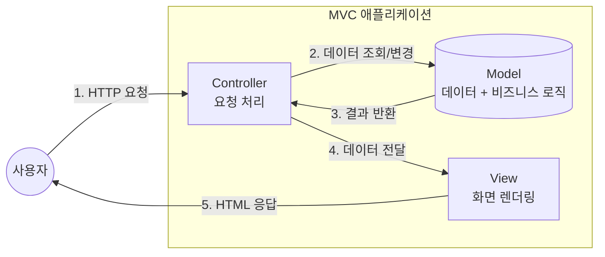
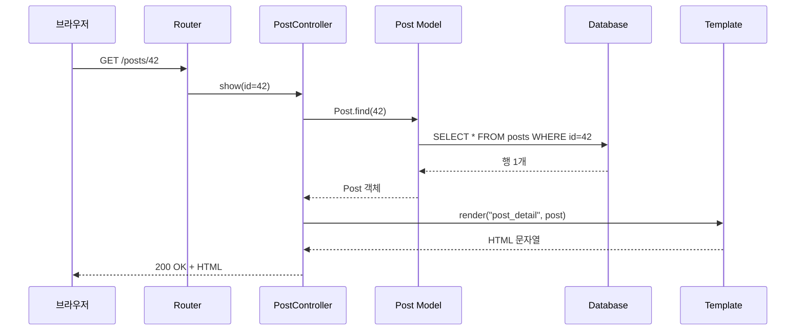
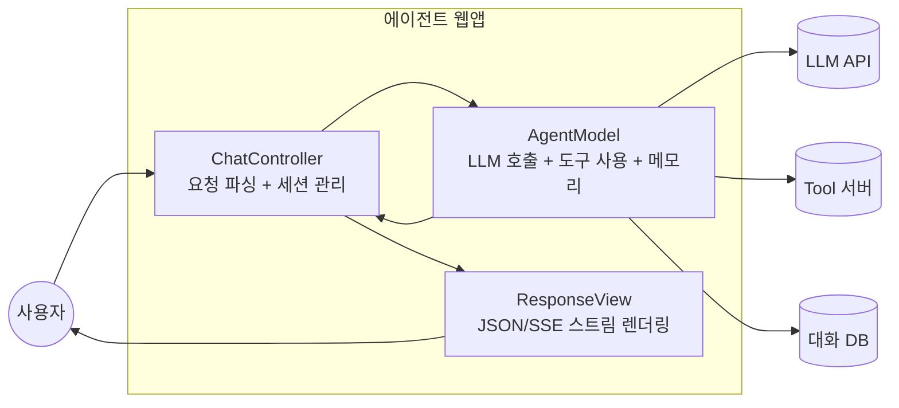

---
생성날짜:
- 2026-04-21 15:10
마지막수정날짜:
- 2026-04-21-화요일 15:10
tags:
- 설계원칙
- 아키텍처패턴
- MVC
- 웹아키텍처
- AI에이전트
별칭:
- MVC
- Model-View-Controller
- 모델 뷰 컨트롤러
type:
- 자료수집
Area/Reasource:
Project:
---
# MVC 패턴

**"사용자 입력을 받는 쪽(Controller), 데이터를 다루는 쪽(Model), 화면에 보여주는 쪽(View)을 셋으로 쪼개 각자 책임을 나눠 갖는 웹/GUI 기본 아키텍처."**

MVC(Model View Controller, 모델-뷰-컨트롤러, 1979년 Trygve Reenskaug가 Smalltalk-80에서 제안한 UI 분리 아키텍처)는 사용자 요청을 처리하고 화면을 그리는 흐름을 세 역할로 나누는 패턴이다. 사무실에 비유하면 민원 창구(Controller), 서류 보관함(Model), 안내판(View)을 각각 다른 직원이 맡는 구조임.

## 한눈에 보기

| 항목 | 내용 |
| --- | --- |
| 분류 | 아키텍처 패턴(UI 계층 분리) |
| 구성 요소 | Model(데이터/도메인), View(표현), Controller(조정) |
| 해결 문제 | 데이터 처리 코드와 화면 렌더링 코드가 뒤섞이는 현상 |
| 대표 프레임워크 | Spring MVC, Django, Ruby on Rails, ASP.NET MVC, Laravel |
| 파생 패턴 | MVP, MVVM, Flux, Redux |
| 포함 관계 | 대부분의 웹 프레임워크가 기본 제공, [[#API Gateway 패턴\|API Gateway]] 뒤 각 서비스 내부 구조로도 자주 사용 |

> **한마디 요약**: "입력 받는 놈, 계산하는 놈, 그리는 놈 이렇게 셋으로 쪼개라."

---

## 일상 비유: 레스토랑 주방

손님이 주문을 하면 이런 순서로 흘러간다.

1. 홀 서버(Controller)가 주문을 받음
2. 주방장(Model)이 레시피와 재료(데이터)를 가지고 요리를 만듦
3. 플레이팅 담당(View)이 접시에 예쁘게 담아 냄

홀 서버는 요리법을 모르고, 주방장은 테이블 번호를 모르고, 플레이팅 담당은 손님 주문을 직접 받지 않는다. 각자 자기 책임만 안다. MVC도 똑같다.

---

## 구조



**책임 구분**:

| 역할 | 책임 | 모르는 것 |
| --- | --- | --- |
| Model | 데이터 구조, 검증 규칙, 비즈니스 로직, DB 접근 | 화면이 어떻게 생겼는지 |
| View | 데이터를 받아 HTML/JSON으로 렌더링 | 데이터가 어떻게 계산됐는지 |
| Controller | 요청 파싱, Model 호출, View 선택 | 화면 디자인, DB 세부 쿼리 |

---

## 요청 처리 흐름 단계 분해



1단계: 브라우저가 URL 입력 → 2단계: Router가 Controller 메서드 매칭 → 3단계: Controller가 Model에 데이터 요청 → 4단계: Model이 DB에서 조회 → 5단계: Controller가 View에 데이터 넘김 → 6단계: View가 HTML 생성 → 7단계: 응답 반환.

---

## 나쁜 예 vs 좋은 예 (Python/Flask)

### 나쁜 예: 한 파일에 다 때려박음

```python
@app.route("/posts/<int:id>")
def show_post(id):
    conn = sqlite3.connect("blog.db")
    row = conn.execute("SELECT * FROM posts WHERE id=?", (id,)).fetchone()
    if not row:
        return "<h1>404 Not Found</h1>", 404

    title, body, created = row[1], row[2], row[3]
    html = f"""
    <html>
      <body>
        <h1>{title}</h1>
        <p>작성일: {created}</p>
        <article>{body}</article>
      </body>
    </html>
    """
    return html
```

문제:
- DB 쿼리, HTML 생성, 요청 처리가 한 함수에 뒤엉킴
- 테스트할 때 DB + 렌더링을 동시에 띄워야 함
- 같은 게시글을 JSON으로도 내려주고 싶으면 코드 복붙

### 좋은 예: MVC로 분리

```python
# models/post.py (Model)
from dataclasses import dataclass

@dataclass
class Post:
    id: int
    title: str
    body: str
    created_at: str

    @classmethod
    def find(cls, id: int) -> "Post | None":
        row = db.execute("SELECT * FROM posts WHERE id=?", (id,)).fetchone()
        return cls(*row) if row else None


# controllers/post_controller.py (Controller)
from flask import render_template, abort
from models.post import Post

def show(id):
    post = Post.find(id)
    if not post:
        abort(404)
    return render_template("post_detail.html", post=post)


# templates/post_detail.html (View)
<html>
  <body>
    <h1>{{ post.title }}</h1>
    <p>작성일: {{ post.created_at }}</p>
    <article>{{ post.body }}</article>
  </body>
</html>


# app.py
app.add_url_rule("/posts/<int:id>", view_func=post_controller.show)
```

장점:
- Model만 따로 단위 테스트 가능(DB mock)
- View는 디자이너가 HTML/CSS만 만지면 됨
- JSON 응답이 필요하면 Controller에 `show_json` 메서드만 추가(`jsonify(post)`)

---

## 파생 패턴과의 비교

| 패턴 | 특징 | 대표 사용처 |
| --- | --- | --- |
| MVC | Controller가 Model, View 둘 다 조정 | Spring MVC, Django, Rails |
| MVP(Model-View-Presenter) | View가 수동적, Presenter가 모든 표시 로직 담당 | Android(과거), WinForms |
| MVVM(Model-View-ViewModel) | ViewModel이 상태 바인딩으로 View와 자동 동기화 | WPF, Vue.js, SwiftUI |
| Flux/Redux | 단방향 데이터 흐름, 상태를 한 곳에 모음 | React 생태계 |

> MVC는 가족이고, MVP/MVVM/Flux는 MVC에서 갈라진 친척들이다. 공통 뿌리: "UI 로직을 세 조각으로 쪼갠다."

---

## 왜 이렇게 설계하는가

**1. 관심사 분리(Separation of Concerns)**: 데이터 변경이 화면 코드를 깨지 않게, 디자인 변경이 비즈니스 로직을 깨지 않게 만든다. 서로 다른 이유로 바뀌는 코드를 같은 파일에 두지 않겠다는 설계 의도임.

**2. 테스트 용이성**: Model을 단위 테스트할 때 브라우저, 템플릿 엔진이 필요 없다. Controller는 Model을 mock해서 요청 처리 로직만 검증 가능.

**3. 병렬 개발**: 백엔드 개발자는 Model/Controller, 프론트엔드/디자이너는 View를 동시에 작업.

**4. 재사용**: 같은 Model을 웹 View, JSON API, CLI 출력에 모두 재사용할 수 있다.

**대안 대비 장점**: 페이지 단위로 코드를 쌓는 구조(PHP 초기 스타일)나 Smart UI 패턴(모든 걸 UI 코드에 집어넣는 방식)에 비해 코드가 커져도 유지보수 비용 증가폭이 훨씬 완만하다.

---

## AI 에이전트 개발에서의 MVC

LLM 기반 에이전트 백엔드도 MVC 구조를 그대로 빌려 쓸 수 있음. 다음과 같이 매핑된다.



| 레이어 | 역할 |
| --- | --- |
| Model | LLM 호출, 프롬프트 구성, 도구 실행, RAG(Retrieval-Augmented Generation, 검색 증강 생성) 컨텍스트 조립 |
| View | 채팅 UI, 스트리밍 응답 포맷, JSON 스키마 |
| Controller | 요청 라우팅, 인증, 세션 ID 관리, 모델 선택 |

FastAPI + LangChain 조합에서도 패턴을 유지하면 **모델 교체(Claude → GPT)** 나 **UI 교체(웹 → CLI → Slack 봇)** 시 Model/View 한쪽만 바꿔치기하면 된다.

---

## 트레이드오프

| 장점 | 단점 |
| --- | --- |
| 역할 분리로 유지보수 쉬움 | 작은 앱에서는 파일 수가 쓸데없이 많아짐 |
| 병렬 개발 가능 | 초기 학습 곡선 존재 |
| 테스트 전략이 명확해짐 | Controller가 비대해지는 Fat Controller 안티패턴 주의 |
| 프레임워크 지원 풍부 | Model이 단순 DTO로 전락하면 Anemic Domain Model 안티패턴 |

**Fat Controller(비대한 컨트롤러)**: 비즈니스 로직이 Controller에 쌓이면 Model이 비어버림. 대응: 서비스 레이어를 추가해 Controller → Service → Model 구조로 확장.

---

## 언제 쓰면 좋은가 / 피해야 할 때

**좋을 때**:
- 여러 화면과 여러 데이터 소스를 다루는 중대형 웹앱
- 팀이 여러 명이고 역할 분담이 필요할 때
- 동일 데이터를 웹 + API + 모바일로 다양하게 내보내야 할 때

**피해야 할 때**:
- 한 화면짜리 정적 사이트
- 마이크로서비스 하나가 순수 작업 큐 처리만 할 때(화면 없음)
- 이벤트 스트림 처리 같은 비-UI 시스템

---

## 직접 확인하기

1. Django 튜토리얼(https://docs.djangoproject.com/en/stable/intro/tutorial01/) 공식 문서 1~4장 따라하면 MVC(Django는 MVT로 부름: Model-View-Template) 감이 잡힘
2. 자기 프로젝트에서 한 Controller 파일을 열어봐라. 200줄을 넘어간다면 Service 레이어 분리 신호
3. `grep -r "SELECT" controllers/` 로 Controller에 DB 쿼리가 섞여 있지 않은지 점검

---

## 다른 패턴과의 관계 (포함 관계)

- **[[API Gateway 패턴]]과 조합**: Gateway 뒤 각 서비스 내부가 MVC 구조인 경우가 흔함
- **[[Microservices vs Monolith|Microservices]]의 단일 서비스 내부 구조로 자주 채택**
- **[[Observer 패턴]] 활용**: 원조 Smalltalk MVC에서 Model이 바뀌면 View에 Observer로 통지
- **[[Strategy 패턴]]과 결합**: Controller가 상황에 따라 다른 렌더링 전략(HTML/JSON/XML) 선택
- **[[Facade 패턴]]의 사촌**: Controller가 복잡한 Model 호출을 단순화해 View에 노출

---

## 요약

> **"요청 받는 Controller, 데이터 다루는 Model, 화면 그리는 View 셋으로 쪼개기. 서로 다른 이유로 바뀌는 코드가 같이 섞이지 않게 만드는 게 목적."**

관련 문서:
- [[API Gateway 패턴]]
- [[Microservices vs Monolith]]
- [[CQRS 패턴]]
- [[Observer 패턴]]
