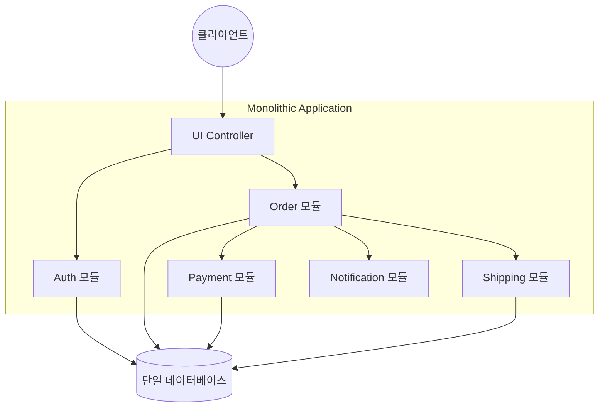
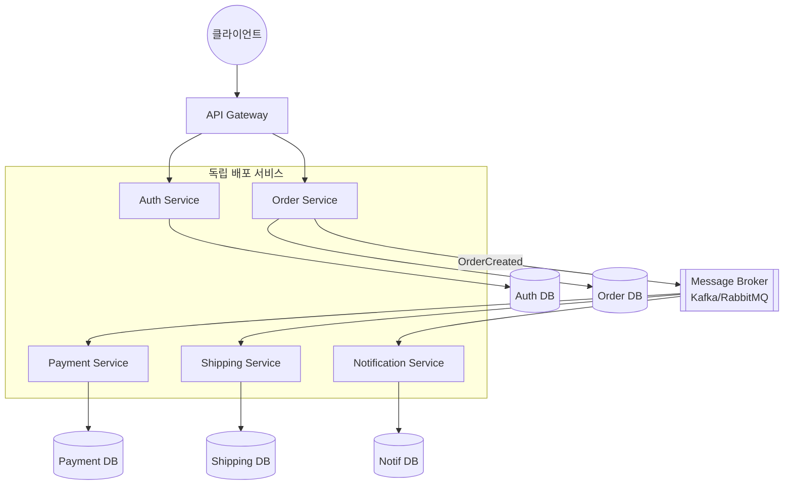
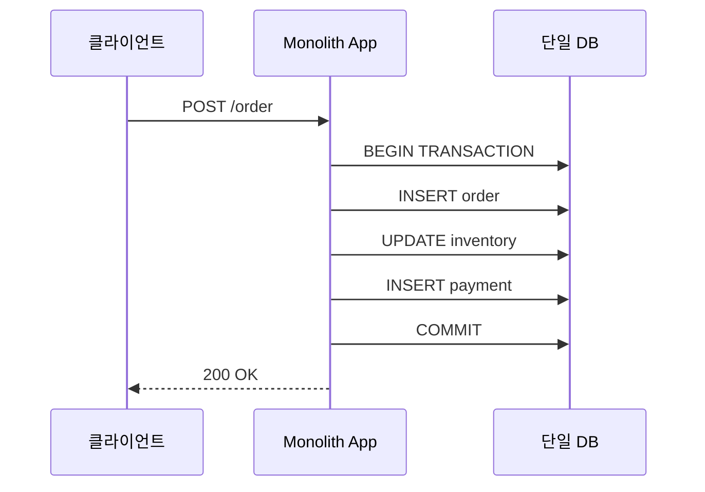
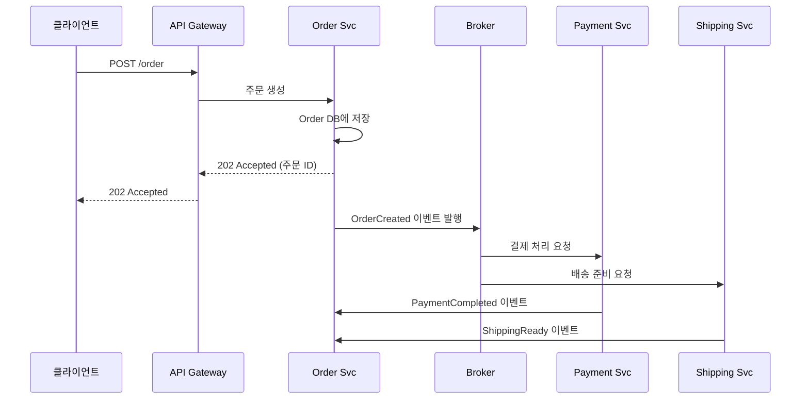
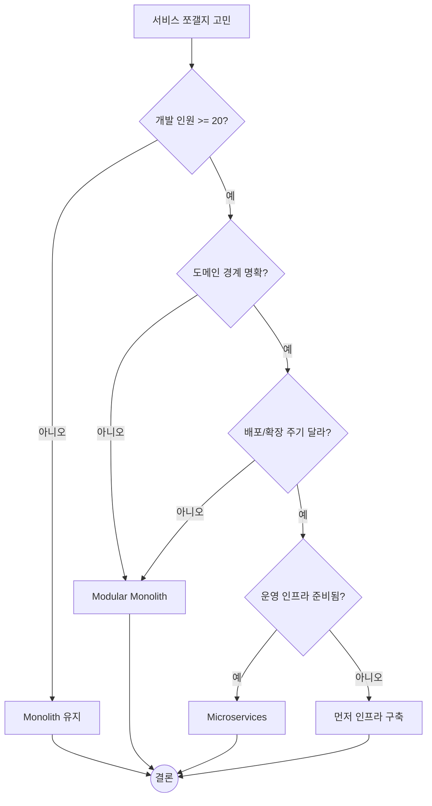
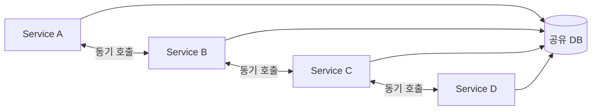
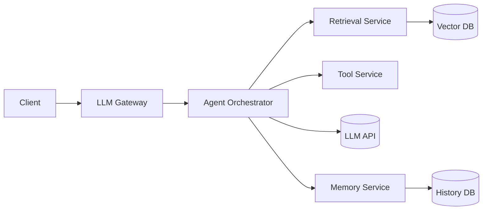

---
생성날짜:
- 2026-04-21 15:20
마지막수정날짜:
- 2026-04-21-화요일 15:20
tags:
- 설계원칙
- 아키텍처패턴
- 마이크로서비스
- 모놀리스
- AI에이전트
별칭:
- Microservices vs Monolith
- 마이크로서비스 대 모놀리스
- 서비스 분리
type:
- 자료수집
Area/Reasource:
Project:
---
# Microservices vs Monolith

**"애플리케이션 하나를 큰 덩어리(Monolith)로 둘지, 독립 배포 가능한 작은 서비스들(Microservices)로 쪼갤지 결정하는 아키텍처 선택지."**

두 가지는 서로 다른 극단의 선택지이고 중간 지대도 있다. Monolith(모놀리스, 한 덩어리 배포 단위로 묶인 애플리케이션)는 모든 기능이 한 코드베이스/한 프로세스에 들어 있다. Microservices(마이크로서비스, 독립적으로 배포·확장 가능한 작은 서비스들의 집합)는 각 기능을 별도 서비스로 쪼개 네트워크로 연결한다. 단독 주택(Monolith) 과 아파트 단지(Microservices)의 차이라고 보면 된다.

## 한눈에 보기

| 항목 | Monolith | Microservices |
| --- | --- | --- |
| 배포 단위 | 1개 (전체 앱) | N개 (서비스마다) |
| 데이터베이스 | 보통 단일 DB | 서비스마다 별도 DB 권장 |
| 서비스 간 호출 | 함수 호출 (인-프로세스) | 네트워크 호출 (HTTP/gRPC/메시지 큐) |
| 팀 구조 | 한 팀 or 여러 팀이 한 리포 공유 | 서비스당 1~2팀 |
| 장애 격리 | 한 모듈 버그가 전체 중단 가능 | 한 서비스 중단이 다른 서비스에 부분 영향 |
| 트랜잭션 | DB 트랜잭션으로 ACID 쉬움 | 분산 트랜잭션(Saga 패턴 등) 필요 |
| 초기 개발 속도 | 빠름 | 느림(인프라 설계 부담) |
| 장기 유지보수 | 커질수록 변경 위험 누적 | 서비스 단위로 교체·폐기 쉬움 |

> **한마디 요약**: "작을 때는 Monolith, 조직과 시스템이 커지면 쪼갤 수 있게 준비한다."

---

## 일상 비유

| 개념 | Monolith | Microservices |
| --- | --- | --- |
| 비유 | 단독 주택(방마다 벽은 있지만 한 건물) | 아파트 단지(동마다 독립, 공용 도로로 연결) |
| 리모델링 | 한 방 공사해도 집 전체 먼지 날림 | 한 동만 공사, 나머지 동은 정상 |
| 입주 비용 | 집 한 채 짓기 저렴 | 단지 인프라(도로/상하수도) 선투자 큼 |
| 보안 | 대문 하나 잠그면 끝 | 동마다 현관, 관리실, CCTV 필요 |

---

## Monolith 구조



한 프로세스 안에서 모듈끼리 함수 호출로 협력한다. 모든 모듈이 같은 DB를 공유함.

---

## Microservices 구조



**핵심 차이점**:
- 서비스마다 자기 DB를 가진다(Database per Service 원칙)
- 서비스 간 통신은 네트워크 호출 or 이벤트 메시지
- [[API Gateway 패턴|API Gateway]]가 외부 진입점 역할

---

## 단계 분해: 주문 처리 흐름 비교

### Monolith 주문 흐름



한 트랜잭션 안에서 다 해결. DB가 알아서 일관성 보장.

### Microservices 주문 흐름



**최종 일관성(Eventual Consistency)**: 주문이 "생성됨" 상태로 먼저 반환되고, 결제/배송은 뒤따라 처리. 중간에 실패하면 보상 트랜잭션(Saga 패턴)으로 롤백.

---

## 언제 Monolith / 언제 Microservices

### Monolith가 적합한 경우

1. **스타트업 초기 또는 MVP(Minimum Viable Product, 최소 기능 제품) 단계**
2. **개발 인원 10명 이하**
3. **트래픽/데이터 규모가 아직 작음**
4. **도메인이 불확실**: 경계가 자주 바뀌는 시기
5. **분산 시스템 운영 경험 부족**

> **Martin Fowler의 Monolith First 원칙**: 처음부터 마이크로서비스로 시작하지 말고, Monolith로 먼저 만들어보고 한계가 명확해지면 쪼개라.

### Microservices가 적합한 경우

1. **수십~수백 명 규모 조직**: 팀 자율성 필요
2. **서비스 간 확장 요구가 다름**: 검색은 빠른데 결제는 느리다 같은 상황
3. **기술 스택을 달리하고 싶음**: 검색은 Go, 추천은 Python, 웹은 Node.js
4. **배포 주기를 분리해야 함**: 팀 A는 하루 10번 배포, 팀 B는 주 1회
5. **장애 격리가 중요**: 결제 서비스가 죽어도 상품 조회는 살아야 함

---

## 판단 기준 체크리스트



**Modular Monolith(모듈형 모놀리스, 한 배포 단위 안에서 모듈 경계를 엄격히 나누는 구조)** 가 중간 정답일 때가 많다. 내부는 마이크로서비스처럼 모듈 경계를 지키되 배포만 한 덩어리로 한다. 나중에 쪼개기 쉬움.

---

## 나쁜 예 vs 좋은 예

### 나쁜 예: 분산 모놀리스(Distributed Monolith)

서비스는 쪼갰는데 서로 강하게 결합된 최악의 상태.



증상:
- 한 서비스 배포하려면 다른 서비스 다 같이 배포해야 함
- 공유 DB 스키마 바꾸면 모든 서비스 영향
- 한 서비스 다운되면 연쇄 장애

**원인**: 서비스를 물리적으로만 쪼개고, 논리적 경계(DB, 계약)는 공유해버려서 생김.

### 좋은 예: 경계가 명확한 Microservices

- 각 서비스가 자기 DB 소유
- 서비스 간 통신은 비동기 이벤트 우선
- 공개 API는 버전 관리된 계약으로 유지
- 한 서비스 장애가 다른 서비스로 전파되지 않도록 Circuit Breaker(회로 차단기, 연쇄 장애 방지 패턴) 적용

---

## AI 에이전트 시스템에서의 선택

LLM 에이전트를 만들 때도 같은 고민이 온다.

**Monolith 형태(초기 적합)**:

```python
# 한 FastAPI 앱 안에 다 있음
app = FastAPI()

@app.post("/chat")
def chat(msg: str):
    context = retrieve(msg)           # RAG
    tools_result = call_tools(msg)    # Tool Use
    response = llm.chat(msg, context, tools_result)
    save_history(msg, response)
    return response
```

**Microservices 형태(규모 커지면)**:



쪼개는 시점:
- Tool 실행이 무거워서 별도 확장이 필요할 때
- Retrieval 트래픽이 급증해 독립 스케일링이 필요할 때
- 여러 팀이 각자 다른 에이전트를 만드는 조직 단계

---

## 트레이드오프 정리

| 관점 | Monolith | Microservices |
| --- | --- | --- |
| 개발 속도(초기) | 빠름 | 느림 |
| 개발 속도(3년 후) | 느려짐 | 잘 쪼갰다면 유지 |
| 배포 | 단순 | 복잡(CI/CD, 컨테이너 오케스트레이션 필요) |
| 디버깅 | 스택트레이스로 추적 | 분산 추적(Distributed Tracing) 필요 |
| 확장 | 전체 복제 | 부분 확장 가능 |
| 비용 | 서버 1대로도 시작 | 인프라 고정비 큼 |
| 팀 자율성 | 낮음 | 높음 |
| 장애 전파 | 한방에 다 죽음 | 부분 장애 |

> **Conway's Law(콘웨이의 법칙)**: "조직 구조가 그대로 시스템 구조로 드러난다." 팀이 하나면 Monolith가 맞고, 팀이 여럿으로 쪼개지면 서비스도 자연스럽게 쪼개진다.

---

## 마이크로서비스 도입 전 체크해야 할 인프라

1. **컨테이너 오케스트레이션**: Kubernetes, ECS
2. **서비스 디스커버리**: 서비스가 서로 어디 있는지 찾는 메커니즘
3. **분산 추적**: OpenTelemetry, Jaeger
4. **중앙 집중 로깅**: ELK, Loki
5. **메시지 브로커**: Kafka, RabbitMQ, NATS
6. **[[API Gateway 패턴|API Gateway]]**
7. **CI/CD 파이프라인**: 서비스별 독립 배포
8. **모니터링 + 알람**: Prometheus, Grafana

이게 갖춰지지 않은 상태에서 마이크로서비스로 시작하면 개발 시간의 절반이 인프라 씨름에 들어간다.

---

## 직접 확인하기

1. 자기 현재 코드베이스에 `git ls-files | wc -l` 로 파일 수 세기, 100개 미만이면 쪼갤 때 아님
2. 팀원에게 "이 기능 바꾸려면 몇 개 모듈 건드려야 하나?" 물어보기, 답이 5개 이상이면 경계가 무너진 신호
3. 공식 자료 참고:
   - [Martin Fowler - Monolith First](https://martinfowler.com/bliki/MonolithFirst.html)
   - [microservices.io - Pattern: Monolithic Architecture](https://microservices.io/patterns/monolithic.html)

---

## 다른 패턴과의 관계 (포함 관계)

- **[[API Gateway 패턴]]은 Microservices의 거의 필수 부속품**
- **[[CQRS 패턴]]은 Microservices 환경에서 특히 빛남**: 읽기/쓰기를 다른 서비스로 쪼갤 수 있음
- **[[MVC 패턴]]은 Monolith 전체 구조 또는 단일 마이크로서비스 내부 구조로 사용**
- **[[Facade 패턴]]의 대규모 버전이 Monolith 내부 모듈 경계**
- **[[Observer 패턴]]의 분산 버전이 Microservices의 이벤트 기반 통신**

---

## 요약

> **"Monolith는 작게 시작할 때 빠르고 단순하다. Microservices는 커졌을 때 팀 자율성과 부분 확장성을 준다. Monolith First로 시작해 경계가 명확해지면 점진적으로 쪼개는 게 대부분의 정답이다."**

관련 문서:
- [[API Gateway 패턴]]
- [[CQRS 패턴]]
- [[MVC 패턴]]
- [[SOLID원칙]]
