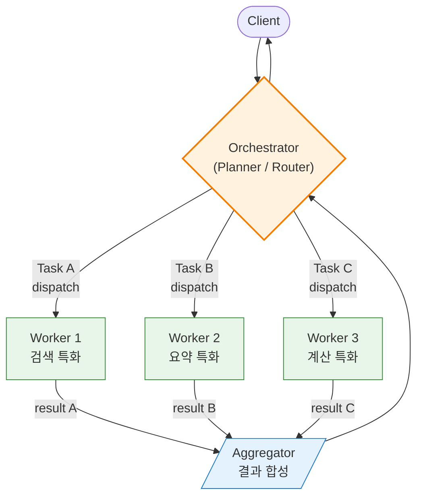
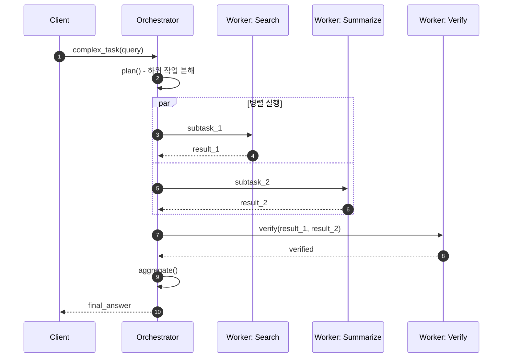
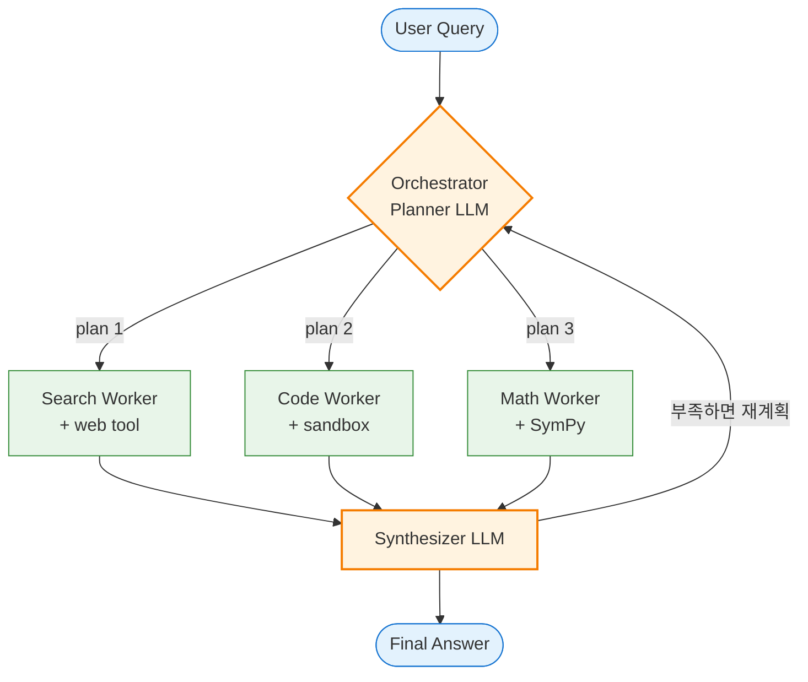

---
생성날짜:
- 2026-04-21 12:17
마지막수정날짜:
- 2026-04-21-화요일 12:17
tags:
- 설계원칙
- 아키텍처패턴
- 오케스트레이터
- 워커
- AI에이전트
- 분산처리
별칭:
- Orchestrator-Worker
- Master-Worker
- Coordinator-Worker
- Controller-Worker
- Orchestration
type:
- 자료수집
Area/Reasource:
Project:
---
# Orchestrator-Worker 아키텍처란?

Orchestrator-Worker(오케스트레이터 워커, 중앙의 조율자(Orchestrator)가 전체 흐름을 지휘하고 여러 작업자(Worker)에게 세부 작업을 분배·취합하는 분산 실행 아키텍처)는 **"지휘자가 악보를 들고 각 연주자에게 언제 무엇을 연주할지 지시하고, 연주자는 자기 악기만 잘 다루는"** 구조다.

Anthropic의 에이전트 설계 가이드("Building Effective Agents")에서도 복잡한 LLM 작업을 풀 때 가장 실용적인 패턴으로 꼽는 구조임.

## 한눈에 보기

| 항목      | 내용                                                              |
| ------- | --------------------------------------------------------------- |
| 분류      | 분산 실행 아키텍처 (Distributed Coordination)                           |
| 한 줄 정의  | 중앙 조율자가 Worker들에게 작업을 분배하고 결과를 합성하는 구조                         |
| 핵심 구성   | Orchestrator(조율자), Worker(작업자), Task Queue/Channel, Result Aggregator |
| 해결 문제   | 복잡한 작업의 분해·병렬 실행·실패 복구·진행 추적                                     |
| 관련 원칙   | 단일 책임, 분업, 중앙 제어, Supervision                                   |
| 대표 기술   | Temporal, AWS Step Functions, Airflow, Celery, Ray, Kubernetes, LangGraph |

> **한마디 요약**: "지휘자가 '너 이것, 너는 저것' 분배하고 결과를 모아 최종 답을 만든다."

---

## 일상 비유

**오케스트라 지휘자와 연주자들**이 가장 직관적인 비유다.

1. 지휘자(Orchestrator)가 전체 악보를 들고 있음
2. 바이올린·첼로·트럼펫 연주자(Worker)는 자기 파트만 알고 있음
3. 지휘자가 "여기서 현악, 다음은 관악" 타이밍을 지시
4. 각 연주자는 자기 연주만 정확히 수행
5. 지휘자가 전체를 하나의 음악으로 조합

다른 비유:
- 건설 현장 감독(Orchestrator)과 기술자들(Worker, 전기공·배관공·미장공)
- 택배 분류 허브(Orchestrator)와 배송 기사들(Worker)
- 식당 주방 총괄 셰프(Expediter)와 파트별 요리사(소테, 그릴, 디저트)
- 야구 감독과 선수단(감독이 작전 지시, 선수는 자기 포지션 플레이)

---

## Orchestration vs Choreography

분산 시스템을 조율하는 방식은 크게 두 가지. 이 둘을 구분 못 하면 설계가 섞인다.

| 관점       | Orchestration (지휘)            | Choreography (안무, 군무)          |
| -------- | ---------------------------- | ------------------------------ |
| 제어       | 중앙 Orchestrator가 지휘           | 없음. 각자 이벤트 보고 반응                |
| 흐름 가시성   | 한 곳에 명시적으로 정의됨                | 여러 곳에 분산, 전체 흐름 추적 어려움          |
| 변경 난이도   | Orchestrator만 수정             | 여러 서비스를 동시에 수정해야 할 수 있음         |
| 결합도      | Worker는 Orchestrator를 모르지만 반대는 알음 | 서로를 모르고 이벤트 스키마만 공유              |
| 실패 처리    | 중앙에서 Retry/Saga 통제            | 각자 알아서 처리, 보상 이벤트 필요            |
| 대표 기술    | Temporal, Step Functions, LangGraph | Kafka + 이벤트 소비자들, Event-Driven |

> 두 방식은 배타적이지 않음. 큰 흐름은 Orchestration, 하위 확산은 Choreography로 섞는 하이브리드가 많음.

---

## 구조



- **Orchestrator(오케스트레이터, 조율자)**: 전체 워크플로우 상태를 보유, 작업 분배·순서 제어·실패 복구 담당
- **Worker(워커, 작업자)**: 특정 종류의 작업을 실행하는 실행자. 여러 인스턴스로 수평 확장 가능
- **Task Queue(태스크 큐)**: Orchestrator가 Worker에게 작업을 전달하는 통로. 동기 호출, 큐(Redis, RabbitMQ), 이벤트 버스 등
- **Aggregator(집계자)**: Worker들의 부분 결과를 모아 최종 응답으로 합치는 단계. Orchestrator 내부에 포함되기도 함

### 작업 흐름 시퀀스



---

## Worker 구성 유형

| 유형                    | 설명                                       | 예시                                  |
| --------------------- | ---------------------------------------- | ----------------------------------- |
| **Homogeneous(동종)**       | 같은 종류의 Worker를 여러 개 수평 확장. 작업은 균일         | 크롤러 1000개 인스턴스, GPU 추론 서버 풀          |
| **Heterogeneous(이종)**     | 서로 다른 전문화 Worker. 각자 잘하는 영역              | Search / Summarize / Code / Math 전문 Agent |
| **Hierarchical(계층)**      | Orchestrator가 다시 하위 Orchestrator를 둠     | Manager Agent → Team Leads → IC Agents |
| **Dynamic(동적)**           | 실행 중 Worker를 생성·회수                      | Kubernetes Job, Ray Actor pool       |

---

## 나쁜 예 vs 좋은 예 (Python)

### 나쁜 예: 한 함수가 전부

```python
def research_topic(query):
    # 검색
    pages = []
    for src in ["google", "arxiv", "github"]:
        pages.extend(search(src, query))

    # 요약
    summaries = []
    for page in pages:
        summaries.append(summarize(page))

    # 검증
    checked = fact_check(summaries)

    # 최종 작성
    return write_report(checked)
```

문제:
- 검색 소스가 순차 실행되어 느림
- 한 소스가 실패하면 전체가 실패
- 중간 진행 상태 추적 불가
- 부분 재시도 불가능(처음부터 다시)

### 좋은 예: Orchestrator-Worker

```python
import asyncio
from dataclasses import dataclass, field
from typing import Callable, Awaitable

@dataclass
class Task:
    name: str
    fn: Callable[..., Awaitable]
    args: tuple = ()
    retries: int = 2

@dataclass
class WorkflowState:
    query: str
    search_results: dict = field(default_factory=dict)
    summaries: list = field(default_factory=list)
    report: str | None = None

class Orchestrator:
    def __init__(self, state: WorkflowState):
        self.state = state

    async def _run_with_retry(self, task: Task):
        last_err = None
        for _ in range(task.retries + 1):
            try:
                return await task.fn(*task.args)
            except Exception as e:
                last_err = e
        raise last_err

    async def run(self):
        # 1단계: 여러 Worker 병렬 검색
        search_tasks = [
            Task("google", search_worker, ("google", self.state.query)),
            Task("arxiv", search_worker, ("arxiv", self.state.query)),
            Task("github", search_worker, ("github", self.state.query)),
        ]
        results = await asyncio.gather(
            *(self._run_with_retry(t) for t in search_tasks),
            return_exceptions=True,
        )
        for t, r in zip(search_tasks, results):
            if isinstance(r, Exception):
                log_error(t.name, r)
            else:
                self.state.search_results[t.name] = r

        # 2단계: 요약 Worker 병렬 호출
        all_pages = sum(self.state.search_results.values(), [])
        self.state.summaries = await asyncio.gather(
            *(summarize_worker(p) for p in all_pages)
        )

        # 3단계: 검증 Worker 순차
        verified = await verify_worker(self.state.summaries)

        # 4단계: 최종 작성 Worker
        self.state.report = await write_worker(verified)
        return self.state.report

# Worker들은 각자 자기 일만 함
async def search_worker(source, query): ...
async def summarize_worker(page): ...
async def verify_worker(summaries): ...
async def write_worker(verified): ...
```

순서·병렬성·재시도가 Orchestrator에 집중되고, Worker는 단일 책임에 집중함.

---

## AI 에이전트 개발 예시: Multi-Agent Research System

Anthropic이 공개한 "Building Effective Agents" 문서에서 제시한 **Orchestrator-Workers 패턴**은 복잡한 지식 작업에서 매우 효과적임. 핵심 아이디어:

1. **Orchestrator LLM**이 요청을 받고 하위 작업을 **동적으로** 분해
2. 각 하위 작업을 **Worker LLM**(도구와 전문 프롬프트를 가진)에게 할당
3. 결과를 받아 합성하거나, 필요 시 추가 하위 작업을 다시 계획

```python
from typing import TypedDict, Literal
from dataclasses import dataclass

@dataclass
class SubTask:
    id: str
    kind: Literal["search", "summarize", "code", "math"]
    description: str
    context: dict

class OrchestratorAgent:
    """하위 작업을 동적으로 분해하고 Worker에게 분배"""

    def __init__(self, workers: dict):
        self.workers = workers  # {"search": SearchWorker, "code": CodeWorker, ...}

    async def plan(self, user_query: str) -> list[SubTask]:
        """LLM에게 '이 질문을 풀려면 어떤 하위 작업이 필요한가?' 질문"""
        plan_prompt = f"""
        다음 질문을 풀기 위한 하위 작업을 JSON 배열로 나열하세요.
        각 작업은 kind(search/summarize/code/math) 와 description 을 가집니다.
        질문: {user_query}
        """
        plan_json = await llm_call(plan_prompt, format="json")
        return [SubTask(**item) for item in plan_json]

    async def run(self, user_query: str):
        subtasks = await self.plan(user_query)

        # 병렬 실행 가능한 것들은 병렬로
        results = await asyncio.gather(*[
            self.workers[st.kind].execute(st) for st in subtasks
        ])

        # 합성
        synthesis_prompt = build_synthesis_prompt(user_query, subtasks, results)
        final = await llm_call(synthesis_prompt)
        return final

class SearchWorker:
    async def execute(self, task: SubTask):
        return await web_search(task.description)

class CodeWorker:
    async def execute(self, task: SubTask):
        code = await llm_write_code(task.description)
        return await sandbox_run(code)

class MathWorker:
    async def execute(self, task: SubTask):
        return symbolic_solver(task.description)

orchestrator = OrchestratorAgent({
    "search": SearchWorker(),
    "code": CodeWorker(),
    "math": MathWorker(),
})

answer = await orchestrator.run("2024년 미국 전기차 판매 성장률과 한국 대비 차이 계산")
```



### LangGraph 구현 예

LangGraph(랭그래프, LangChain의 상태 그래프 기반 에이전트 오케스트레이션 라이브러리)는 이 패턴을 **그래프(노드=Worker, 엣지=흐름)** 로 명시함.

```python
from langgraph.graph import StateGraph, END

def orchestrator_node(state):
    plan = llm.plan(state["query"])
    return {"plan": plan, "next": plan[0].kind}

def search_node(state): ...
def code_node(state): ...
def synthesize_node(state): ...
def route(state):
    # 남은 plan이 있으면 해당 Worker로, 없으면 synth
    if state["plan"]:
        return state["plan"][0].kind
    return "synthesize"

graph = StateGraph(dict)
graph.add_node("orchestrator", orchestrator_node)
graph.add_node("search", search_node)
graph.add_node("code", code_node)
graph.add_node("synthesize", synthesize_node)

graph.set_entry_point("orchestrator")
graph.add_conditional_edges("orchestrator", route)
graph.add_edge("search", "orchestrator")
graph.add_edge("code", "orchestrator")
graph.add_edge("synthesize", END)

app = graph.compile()
```

---

## Orchestrator-Worker의 두 계열

| 계열             | 특징                                 | 대표 기술                       |
| -------------- | ---------------------------------- | --------------------------- |
| **Workflow 엔진**    | 장기 실행, 내구성(Durability), 재시도, 상태 복원 | Temporal, AWS Step Functions, Airflow |
| **Task Queue**     | 짧은 작업 대량 처리, 큐 기반 확산                 | Celery, RQ, Sidekiq, BullMQ |
| **Agent Graph**    | LLM 추론 기반 동적 분해·재계획                  | LangGraph, CrewAI, AutoGen  |
| **Compute Orchestrator** | 클러스터 자원 관리·스케줄링                   | Kubernetes, Ray, Slurm      |

---

## 언제 쓰면 좋은가

1. **복잡한 작업을 작고 독립적인 단위로 분해**할 수 있을 때
2. **병렬 실행으로 지연을 크게 줄일 수 있을** 때
3. **전체 흐름이 한 곳에 명시적**이어야 할 때 (감사, 디버깅, 컴플라이언스)
4. **장시간 실행·내구성**이 필요한 워크플로우 (며칠 걸리는 사가, 배치 잡)
5. **이기종 전문가가 필요**한 경우 (검색, 요약, 코드 실행, 수식 계산을 각기 다른 Worker가)
6. **동적 작업 생성**이 필요할 때 (LLM이 계획을 세워 하위 작업 생성)

### 언제 쓰면 안 좋은가

- 하위 작업 수가 적고 의존성이 거의 없어 단순 함수 호출이 나은 경우
- 작업이 완전 독립적이어서 Orchestrator 없이 이벤트 기반(Choreography)이 더 간결한 경우
- Orchestrator가 병목이 되어 수평 확장이 어렵다고 판단되는 초대규모 시스템(이때는 계층적 Orchestration 또는 Choreography 전환)

---

## 트레이드오프

| 장점                              | 단점                              |
| ------------------------------- | ------------------------------- |
| 전체 흐름이 한 곳에 명시적                   | Orchestrator가 병목·SPOF 위험        |
| Worker 독립 배포·확장·교체              | Orchestrator 로직이 점점 무거워짐        |
| 실패 복구·재시도·보상 중앙 제어               | 분산 트랜잭션(Saga) 설계 복잡성           |
| 부분 실행·재개 가능(Workflow 엔진 사용 시)    | 디버깅 시 "Orchestrator 상태 재현"이 까다로움 |
| 병렬화로 latency 단축                  | Worker 늘수록 통신·직렬화 비용 증가          |
| LLM 기반 동적 분해로 유연성 극대화            | 비결정성 증가, 평가·모니터링 복잡             |

---

## 실전 주의점

### 1. 멱등성과 재시도
Orchestrator가 Worker에게 보낸 요청이 타임아웃 나도 Worker는 처리 중일 수 있음. Worker 실행은 **멱등(같은 요청을 여러 번 받아도 결과 동일)** 하게 설계해야 함. 작업 ID 기반 중복 체크가 기본.

### 2. 실패 처리 전략
- **Retry**(재시도): 네트워크·일시적 오류에 대응. 지수 백오프(exponential backoff) 권장
- **Circuit Breaker**(서킷 브레이커, 계속 실패하는 Worker로의 호출을 일시 차단): 장애 확산 방지
- **Compensation**(보상, Saga): 일부 Worker는 성공하고 일부는 실패했을 때 되돌리기
- **Dead Letter**: 최종 실패 작업은 별도 보관 후 수동 처리

### 3. 장시간 Workflow는 상태 영속화
30초 넘는 Workflow는 Orchestrator 프로세스가 죽어도 복원되어야 함. Temporal 같은 엔진은 실행 상태를 DB에 저장해 어디까지 진행했는지 이어 실행함. 직접 만들면 이벤트 소싱 패턴으로 구현.

### 4. Worker 간 상태 공유 주의
Worker들이 서로 직접 통신하기 시작하면 Orchestration 장점이 사라짐. 상태는 Orchestrator 또는 공용 저장소를 통해 교환할 것.

### 5. LLM Orchestrator의 무한 루프 방지
LLM 기반 Orchestrator는 "계속 재계획"에 빠질 수 있음. 최대 반복 횟수, 총 토큰 예산, 총 실행 시간 상한을 반드시 설정.

### 6. 관측성
전체 실행을 하나의 **trace**로 묶어야 함. Orchestrator에서 시작된 span 아래로 모든 Worker span이 nested되도록 OpenTelemetry 계측. Langfuse(랭퓨즈, LLM 관측성 플랫폼) 같은 LLM 전용 도구는 Agent 계층을 자연스럽게 시각화함.

---

## 다른 패턴과의 관계 (포함 관계)

- **Master-Slave 패턴의 현대적 명명**: 과거 "Master-Slave"로 불리던 구조의 중립적 용어. 본질은 같음
- **[[Event-Driven 아키텍처]]와 대비되는 Choreography의 반대편**: Orchestration(중앙 지휘) vs Choreography(탈중앙 이벤트 반응). 실무에서는 혼합
- **[[Pipeline 아키텍처]]와 차이**: Pipeline은 단방향 선형 흐름, Orchestrator는 분기·루프·조건부 재계획 가능. Pipeline이 Orchestrator의 특수 케이스로 볼 수도 있음
- **[[Pub-Sub 아키텍처]]와 조합**: Orchestrator가 Pub/Sub을 Worker 분배 채널로 쓰면 수평 확장 쉬움. Celery, BullMQ 등이 이 구조
- **Command 패턴의 분산 버전**: 각 하위 작업을 Command 객체로 표현하면 큐 저장, 재실행, 취소가 자연스러워짐
- **Saga 패턴과 조합**: 장기 실행 분산 트랜잭션을 Orchestration-based Saga로 구현
- **Supervisor 트리(Erlang/Elixir)의 핵심 아이디어**: 감독자가 워커를 감시하고 실패 시 재시작. Orchestrator-Worker의 장애 복구 측면

---

## 직접 확인하기

자기 시스템에서 다음 패턴을 찾아봐라:

1. "한 요청을 받아 여러 서브시스템을 순서·조건에 따라 호출"
2. "중간에 하나가 실패하면 보상 로직이 필요"
3. "병렬로 호출하면 훨씬 빠른데 지금은 순차"
4. "전체 흐름을 감사 로그로 남기고 싶음"

하나라도 해당하면 Orchestrator-Worker 후보다.

**실습 루트**:
- 짧은 작업 대량 처리: Celery + Redis로 Worker 풀 만들어 보기
- 장기 실행 Workflow: Temporal Python SDK 튜토리얼
- LLM Agent Orchestration: LangGraph 공식 튜토리얼의 "multi-agent supervisor" 예제
- 분산 컴퓨팅: Ray actor 패턴

참고 자료:
- [Anthropic: Building Effective Agents](https://www.anthropic.com/engineering/building-effective-agents)
- [Temporal: What is a Workflow](https://docs.temporal.io/workflows)
- [AWS: Orchestration vs Choreography](https://aws.amazon.com/compare/the-difference-between-orchestration-and-choreography/)

---

## 요약

> **"지휘자가 전체를 안다. 연주자는 자기 파트만 안다. 지휘자가 언제 누구에게 무엇을 시킬지 결정하고 결과를 합쳐 최종 음악을 만든다."**

관련 문서:
- [[Event-Driven 아키텍처]]
- [[Pipeline 아키텍처]]
- [[Pub-Sub 아키텍처]]
- [[Command 패턴(요청의 객체화)]]
