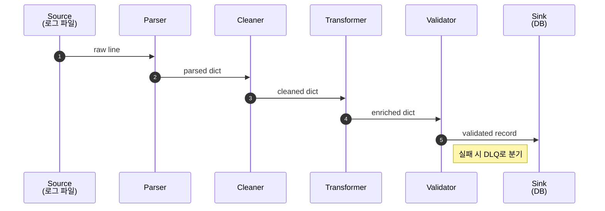
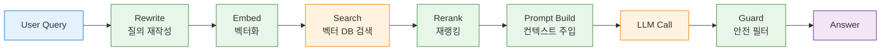

---
생성날짜:
- 2026-04-21 12:16
마지막수정날짜:
- 2026-04-21-화요일 12:16
tags:
- 설계원칙
- 아키텍처패턴
- 파이프라인
- 데이터파이프라인
- AI에이전트
- ETL
별칭:
- Pipeline
- Pipes and Filters
- 파이프라인 아키텍처
- 데이터 파이프라인
type:
- 자료수집
Area/Reasource:
Project:
---
# Pipeline 아키텍처란?

Pipeline(파이프라인, 데이터를 여러 독립 단계(Stage/Filter)를 거쳐 순차적으로 변환·처리하는 아키텍처 스타일)는 **"입력 데이터가 컨베이어 벨트 위를 지나가며 공장 각 구간에서 가공되듯, 한 방향으로 흐르며 각 단계가 자기 일만 하는"** 구조다.

원래 이름은 **Pipes and Filters**(파이프 앤 필터, 단계 사이를 연결하는 파이프와 실제 변환을 수행하는 필터로 구성된 전통적 구조). Unix 셸의 `|` 연산자가 바로 이 패턴의 교과서적 구현체임.

## 한눈에 보기

| 항목      | 내용                                                  |
| ------- | --------------------------------------------------- |
| 분류      | 아키텍처 스타일 (Pipes and Filters)                        |
| 한 줄 정의  | 데이터가 단계별 필터를 거쳐 변환되는 단방향 흐름                         |
| 핵심 구성   | Source, Filter(Stage), Pipe(채널), Sink               |
| 해결 문제   | 거대한 단일 변환 함수 분해, 재조립, 병렬화, 스트리밍 처리                  |
| 관련 원칙   | SRP, 합성(Composition), 불변성                           |
| 대표 기술   | Unix pipe, scikit-learn Pipeline, LangChain LCEL, Apache Beam, Kafka Streams, tf.data |

> **한마디 요약**: "원료가 공장 컨베이어를 따라 흐르며 각 구간에서 가공. 구간은 서로 모르고 자기 일만 함."

---

## 일상 비유

**자동차 조립 공장의 컨베이어 벨트**가 가장 직관적인 비유다.

1. **차체 프레임** 투입(Source)
2. **엔진 장착** 스테이션(Filter 1)
3. **도장** 부스(Filter 2)
4. **유리·시트** 조립(Filter 3)
5. **검사**(Filter 4)
6. 완성차 출고(Sink)

각 스테이션은 앞 스테이션이 뭘 했는지, 뒷 스테이션이 뭘 할지 모름. 자기 구간에 들어온 차에만 자기 일을 함. 컨베이어(Pipe)가 연결만 해 줌.

다른 비유:
- 세차장(물 뿌리기 → 거품 → 솔질 → 린스 → 건조)
- 우유 생산(착유 → 살균 → 균질화 → 포장 → 유통)
- 사진 보정 앱 필터 체인(원본 → 노출 보정 → 색감 보정 → 선명도 → 워터마크)

---

## 구조


- **Source(소스)**: 파이프라인 입구. 파일, API, 이벤트 스트림 등
- **Filter(필터, Stage, Step)**: 입력을 받아 변환한 뒤 출력을 내는 독립 단위. 상태를 공유하지 않는 게 원칙
- **Pipe(파이프, Channel)**: 필터 간 데이터 전달 통로. 동기 함수 호출, 메모리 큐, 메시지 큐 등 어떤 형태든 가능
- **Sink(싱크)**: 파이프라인 출구. DB 저장, 파일 쓰기, 응답 반환 등

### 파이프라인 흐름 시퀀스



---

## Pipeline의 네 가지 스타일

| 스타일              | 데이터 단위     | 예시                                 |
| ---------------- | ---------- | ---------------------------------- |
| **Batch**           | 파일/대용량 덩어리 | 일일 ETL, Airflow DAG, Spark 배치 잡     |
| **Micro-batch**     | 수 초~분 단위 묶음 | Spark Streaming, dbt 증분 빌드          |
| **Streaming**       | 레코드 단위 실시간 | Kafka Streams, Apache Flink, Beam  |
| **Request-level**   | 한 건 요청     | scikit-learn Pipeline, LangChain LCEL |

아키텍처 관점에서는 네 가지 모두 "Filter가 Pipe로 연결된다"는 뼈대가 같음. 데이터 한 건이냐, 백만 건이냐, 무한 스트림이냐만 다름.

---

## 나쁜 예 vs 좋은 예 (Python)

### 나쁜 예: 거대 함수

```python
def process_logs(raw_text):
    lines = raw_text.split("\n")
    result = []
    for line in lines:
        if not line.strip():
            continue
        # 파싱
        parts = line.split(" ")
        ts, level, msg = parts[0], parts[1], " ".join(parts[2:])
        # 정제
        msg = msg.replace("\t", " ").strip().lower()
        # 필터링
        if level not in ("ERROR", "WARN"):
            continue
        # 보강
        enriched = {"ts": ts, "level": level, "msg": msg, "host": get_host()}
        # 검증
        if len(enriched["msg"]) > 10:
            result.append(enriched)
    return result
```

문제:
- 테스트하려면 전체 문자열을 만들어 넣어야 함
- 단계 순서 변경, 단계 교체가 한 함수 수정
- 병렬화, 스트리밍 전환이 어려움
- 중간에 어디서 틀렸는지 찾기 힘듦

### 좋은 예: Pipeline

```python
from typing import Iterable, Iterator
from dataclasses import dataclass

@dataclass
class LogRecord:
    ts: str
    level: str
    msg: str
    host: str | None = None

# 각 Filter는 Iterator -> Iterator 형태
def parse(lines: Iterable[str]) -> Iterator[LogRecord]:
    for line in lines:
        if not line.strip():
            continue
        parts = line.split(" ")
        yield LogRecord(ts=parts[0], level=parts[1], msg=" ".join(parts[2:]))

def clean(records: Iterable[LogRecord]) -> Iterator[LogRecord]:
    for r in records:
        r.msg = r.msg.replace("\t", " ").strip().lower()
        yield r

def filter_level(records: Iterable[LogRecord]) -> Iterator[LogRecord]:
    for r in records:
        if r.level in ("ERROR", "WARN"):
            yield r

def enrich(records: Iterable[LogRecord]) -> Iterator[LogRecord]:
    host = get_host()
    for r in records:
        r.host = host
        yield r

def validate(records: Iterable[LogRecord]) -> Iterator[LogRecord]:
    for r in records:
        if len(r.msg) > 10:
            yield r

# 조립 (Pipe는 제너레이터 체이닝)
def run_pipeline(raw_text: str) -> list[LogRecord]:
    lines = iter(raw_text.split("\n"))
    pipeline = validate(enrich(filter_level(clean(parse(lines)))))
    return list(pipeline)
```

**Generator(제너레이터, 필요할 때 한 건씩 값을 내주는 지연 평가 객체)** 기반이라 메모리 효율적이고 스트리밍 친화적임. 각 단계는 단독 테스트 가능, 순서 변경은 조립부만 건드리면 됨.

---

## AI 에이전트 개발 예시: RAG 파이프라인

RAG(Retrieval-Augmented Generation, 검색 증강 생성, LLM에 외부 지식을 검색해 주입해 환각을 줄이는 기법)는 파이프라인 아키텍처의 대표 사례임.



```python
from dataclasses import dataclass, field

@dataclass
class RAGContext:
    query: str
    rewritten: str | None = None
    embedding: list[float] | None = None
    retrieved: list[dict] = field(default_factory=list)
    reranked: list[dict] = field(default_factory=list)
    prompt: str | None = None
    answer: str | None = None

class Stage:
    def __call__(self, ctx: RAGContext) -> RAGContext:
        raise NotImplementedError

class QueryRewriter(Stage):
    def __call__(self, ctx):
        ctx.rewritten = llm_rewrite(ctx.query)
        return ctx

class Embedder(Stage):
    def __call__(self, ctx):
        ctx.embedding = embed(ctx.rewritten or ctx.query)
        return ctx

class VectorSearch(Stage):
    def __init__(self, k=20):
        self.k = k
    def __call__(self, ctx):
        ctx.retrieved = vectordb.search(ctx.embedding, k=self.k)
        return ctx

class Reranker(Stage):
    def __init__(self, top_n=5):
        self.top_n = top_n
    def __call__(self, ctx):
        ctx.reranked = cross_encoder.rerank(ctx.query, ctx.retrieved)[:self.top_n]
        return ctx

class PromptBuilder(Stage):
    def __call__(self, ctx):
        ctx.prompt = build_prompt(ctx.query, ctx.reranked)
        return ctx

class LLMCaller(Stage):
    def __call__(self, ctx):
        ctx.answer = llm.chat(ctx.prompt)
        return ctx

class SafetyGuard(Stage):
    def __call__(self, ctx):
        if is_unsafe(ctx.answer):
            ctx.answer = "[안전 정책으로 응답 제한]"
        return ctx

class Pipeline:
    def __init__(self, stages: list[Stage]):
        self.stages = stages
    def run(self, query: str) -> str:
        ctx = RAGContext(query=query)
        for stage in self.stages:
            ctx = stage(ctx)
        return ctx.answer

rag = Pipeline([
    QueryRewriter(),
    Embedder(),
    VectorSearch(k=30),
    Reranker(top_n=5),
    PromptBuilder(),
    LLMCaller(),
    SafetyGuard(),
])

answer = rag.run("2025년 전기차 시장 규모는?")
```

단계 추가(예: **HyDE**(Hypothetical Document Embeddings, 가상 문서를 먼저 생성해 임베딩 품질을 높이는 기법) 삽입)나 Reranker 교체가 리스트 수정만으로 끝남.

### LangChain LCEL 스타일

LangChain(랭체인, LLM 앱 개발 프레임워크)의 LCEL(LangChain Expression Language)은 `|` 연산자로 Runnable을 이어 붙이는 파이프라인 DSL임.

```python
from langchain_core.runnables import RunnableParallel, RunnablePassthrough

chain = (
    {"context": retriever | rerank, "question": RunnablePassthrough()}
    | prompt_template
    | llm
    | output_parser
)

answer = chain.invoke("2025년 전기차 시장 규모는?")
```

`|`는 Unix pipe의 계보를 잇는 기호다. 각 단계가 입력을 받아 출력을 내보내는 함수라는 점이 핵심.

---

## 동시성·병렬성 스타일

| 스타일              | 설명                                    | 구현                             |
| ---------------- | ------------------------------------- | ------------------------------ |
| **순차(Sequential)**   | 한 건씩 모든 단계 순서대로                      | Python 제너레이터 체인                 |
| **단계별 병렬**         | 단계 사이에 큐를 두고 각 단계를 별도 스레드/프로세스로 | Go 채널, Python `asyncio.Queue`  |
| **데이터 병렬**         | 같은 파이프라인을 여러 샤드에 복제해 처리                 | Kafka 파티션, Spark Partition     |
| **분기·합류(Fan-out/in)** | 한 단계 출력이 여러 단계로 갈라지고 합쳐짐              | Apache Beam, Airflow DAG       |

---

## 언제 쓰면 좋은가

1. **데이터 변환이 여러 명확한 단계**로 나뉠 때 (ETL, 로그 처리, 미디어 인코딩)
2. **단계 재사용·재조립**이 필요할 때 (같은 전처리를 여러 모델에 써야 함)
3. **스트리밍/대용량 처리**가 필요할 때 (메모리에 한꺼번에 못 올림)
4. **머신러닝 전처리**(토큰화 → 정규화 → 임베딩 → 추론 → 후처리)
5. **단계별 모니터링/지표 수집**이 필요할 때

### 언제 쓰면 안 좋은가

- 단계 간 양방향 상호작용이나 복잡한 분기 조건이 많은 경우(State Machine이 나음)
- 한 건 처리 비용이 너무 작아서 스테이지 오버헤드가 더 큰 경우
- 단계 간 데이터 구조가 매번 크게 달라서 공통 DTO 설계가 어려운 경우

---

## 트레이드오프

| 장점                      | 단점                             |
| ----------------------- | ------------------------------ |
| 단계별 SRP 명확, 재사용·교체 쉬움    | 단계 경계 설계 잘못하면 계속 바뀌는 DTO 스키마   |
| 스트리밍/지연 평가 자연스러움         | 단계 수가 많아지면 디버깅·지연 누적 관리 필요     |
| 병렬화·분산 처리에 친화적           | 상태가 필요한 처리(집계, 세션)는 표현이 어색해짐   |
| 조립식 구성으로 실험적 변경이 저렴      | 단계 간 데이터 직렬화 비용(특히 프로세스 간)     |
| 각 단계를 독립 테스트 가능          | 오류 발생 위치 추적 위해 관측성 인프라 필요      |

---

## 실전 주의점

### 1. 데이터 스키마(계약) 관리
단계 사이를 흐르는 데이터 구조를 명시적으로 정의해야 함. Pydantic 모델, dataclass, Avro, Protobuf 등으로 "이 단계는 이 형태를 받아 이 형태를 낸다"를 박제하지 않으면 리팩터링마다 파이프라인이 깨짐.

### 2. Backpressure(역압, 역압 제어)
느린 스테이지가 앞 스테이지를 막아야 시스템이 폭주하지 않음. 큐 기반 구현에서는 큐 크기 제한, 드롭 정책, 스로틀링 중 하나를 선택해야 함.

### 3. Poison Pill(나쁜 입력) 격리
하나의 잘못된 레코드가 전체를 멈추면 안 됨. 단계별로 `try/except`를 두고 실패 레코드는 DLQ 또는 에러 버킷으로 빼낼 것.

### 4. 관측성(Observability)
각 단계 진입/종료, 처리 레이턴시, 레코드 수, 에러 수를 메트릭으로 내보내는 게 필수. **OpenTelemetry**로 각 레코드에 trace_id를 붙여 전파하면 어느 단계에서 터졌는지 추적 가능.

### 5. 스테이지 격리 원칙
이상적으로 스테이지는 **입력만 보고 출력을 만드는 순수 함수**에 가까워야 함. 전역 상태 접근, 다른 스테이지 직접 호출은 피할 것.

### 6. 재실행 가능성(Idempotency)
배치 파이프라인은 재처리가 잦다. 같은 입력으로 다시 돌렸을 때 중복 적재되지 않도록 멱등성 설계가 필요함.

---

## 다른 패턴과의 관계 (포함 관계)

- **[[Chain of Responsibility 패턴]]의 Pipeline 변형**: CoR의 "모두 통과" 버전이 사실상 Pipeline. CoR은 객체지향 스케일(요청 하나, 프로세스 안), Pipeline은 아키텍처 스케일(대용량 데이터 흐름, 프로세스 간)
- **[[Event-Driven 아키텍처]]와 조합**: 각 스테이지를 이벤트 소비자로 구현하면 Event-Driven Pipeline. Kafka Streams가 대표적
- **[[Pub-Sub 아키텍처]]와 결합**: 스테이지 간 통신을 토픽으로 두면 스테이지가 독립 배포·스케일 가능
- **[[Orchestrator-Worker 아키텍처]]와 구분**: Orchestrator는 분기·루프·조건 제어가 중심, Pipeline은 단방향 선형 흐름이 중심
- **MapReduce의 일반화**: Map/Shuffle/Reduce가 3단계 Pipeline의 특수 형태
- **Functional Composition과 수학적으로 동일**: `f ∘ g ∘ h` 같은 함수 합성이 바로 Pipeline임

---

## 직접 확인하기

자기 코드에서 "데이터가 여러 변환을 거쳐 최종 결과가 된다"는 흐름을 찾아봐라. 다음을 체크:

1. 변환이 3단계 이상 일자 순서인가
2. 각 단계가 다른 시스템에서도 재사용될 여지가 있는가
3. 메모리에 전부 올리기보다 스트리밍이 이득인가
4. 단계별 메트릭(throughput, latency, error rate)을 따로 보고 싶은가

둘 이상 해당하면 Pipeline 후보다.

직접 돌려보려면:

```bash
# Unix pipe 실습
cat access.log | grep ERROR | awk '{print $1}' | sort | uniq -c | sort -rn | head
```

`cat → grep → awk → sort → uniq → sort → head` 여섯 단계 Pipeline이다. 각 단계는 다른 단계 존재를 모르고 stdin을 받아 stdout을 낼 뿐이다.

[scikit-learn Pipeline 공식 문서](https://scikit-learn.org/stable/modules/compose.html)나 [Apache Beam 프로그래밍 가이드](https://beam.apache.org/documentation/programming-guide/)를 보면 산업 수준 Pipeline이 어떻게 추상화되는지 감이 온다.

---

## 요약

> **"데이터를 한 방향으로 흐르게 하고, 각 단계는 자기 변환만 책임져라. 조립과 분해가 자유로운 컨베이어 벨트 구조."**

관련 문서:
- [[Event-Driven 아키텍처]]
- [[Orchestrator-Worker 아키텍처]]
- [[Pub-Sub 아키텍처]]
- [[Chain of Responsibility 패턴]]
