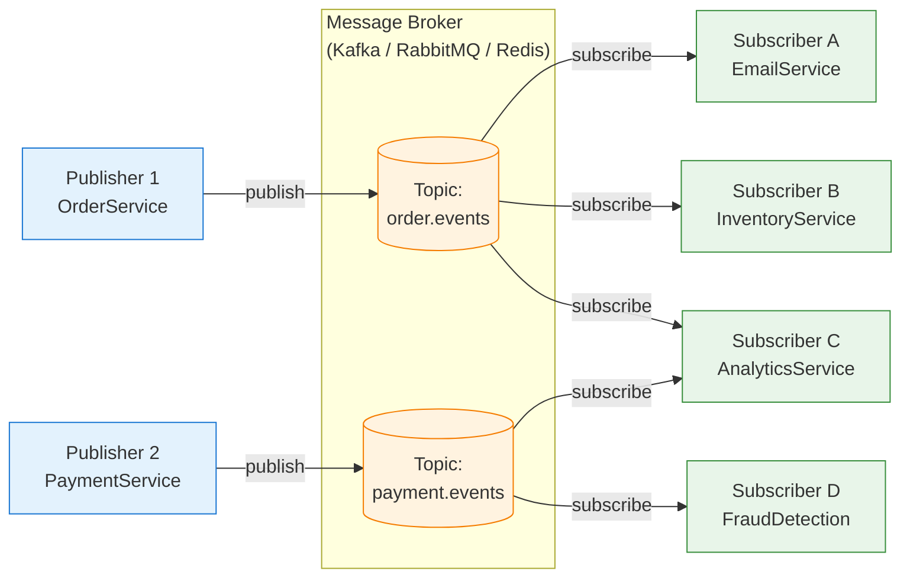
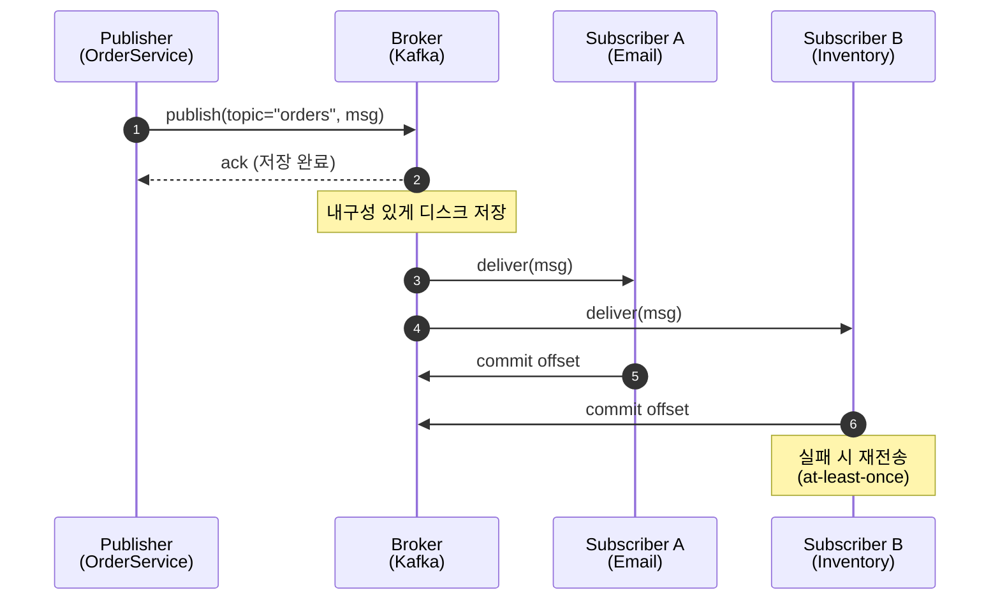
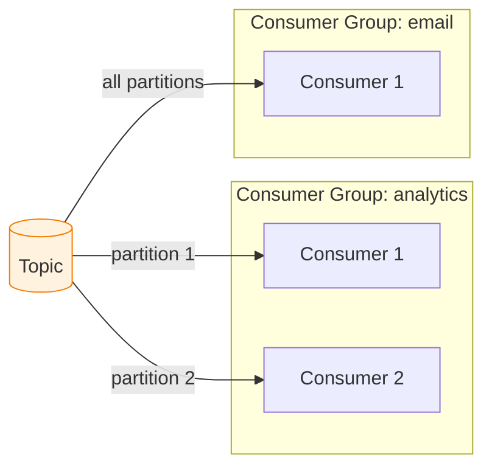
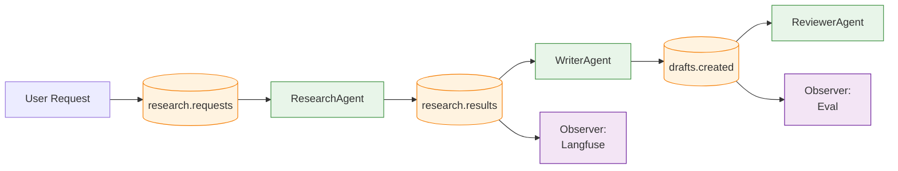

---
생성날짜:
- 2026-04-21 12:18
마지막수정날짜:
- 2026-04-21-화요일 12:18
tags:
- 설계원칙
- 아키텍처패턴
- PubSub
- 메시지브로커
- 비동기
- AI에이전트
- 분산시스템
별칭:
- Pub/Sub
- Pub-Sub
- Publish-Subscribe
- 발행-구독
- 메시지 브로커
type:
- 자료수집
Area/Reasource:
Project:
---
# Pub/Sub 아키텍처란?

Pub/Sub(퍼블리시-서브스크라이브, 발행-구독, 발행자(Publisher)가 특정 토픽(Topic)으로 메시지를 보내고 해당 토픽을 구독한 구독자(Subscriber)들이 메시지를 수신하는 시스템 레벨 비동기 메시징 아키텍처)는 **"발행자와 구독자 사이에 메시지 브로커(Broker)를 두고, 발행자는 누가 듣는지 모르고 구독자는 어디서 왔는지 신경 쓰지 않는"** 구조다.

Observer 패턴의 프로세스 경계·네트워크 경계를 넘어선 **분산 시스템 레벨 구현체**로 보면 됨.

## 한눈에 보기

| 항목      | 내용                                                    |
| ------- | ----------------------------------------------------- |
| 분류      | 메시징 패턴 / 시스템 통신 아키텍처                                  |
| 한 줄 정의  | 중간 브로커를 통해 Publisher가 Topic으로 메시지를 발행하고 Subscriber가 수신 |
| 핵심 구성   | Publisher, Broker, Topic, Subscription, Subscriber    |
| 해결 문제   | 서비스 간 강결합, 비동기 통신, 팬아웃(Fan-out), 확장성                  |
| 관련 원칙   | 느슨한 결합, 비동기, 위치 투명성                                   |
| 대표 기술   | Apache Kafka, RabbitMQ, Redis Pub/Sub, Google Pub/Sub, AWS SNS, NATS, MQTT |

> **한마디 요약**: "라디오 방송국과 수신기. 방송국은 송출만, 수신기는 주파수만 맞추면 알아서 들음."

---

## 일상 비유

**라디오 방송과 청취자**가 가장 깔끔한 비유다.

1. 방송국(Publisher)이 "100.1MHz 뉴스" 채널(Topic)로 음성을 송출
2. 전파(Broker)가 해당 주파수를 공중에 뿌림
3. 청취자(Subscriber)는 주파수만 맞추면 어디서든 들림
4. 방송국은 청취자 수·위치·이름을 모름
5. 청취자가 라디오를 꺼도 방송은 계속 나감

다른 비유:
- 신문 구독(신문사 → 우체국 → 구독자, 우체국이 Broker)
- 카페 호출 벨(바리스타가 번호 방송, 해당 번호 손님만 반응)
- 슬랙 채널(#general에 글 올리면 해당 채널 구독한 사람 모두 알림)
- 유튜브 채널 구독(업로드 시 구독자에게 알림, 업로더는 구독자 개개인 모름)

---

## 핵심 용어

| 용어              | 의미                                                 |
| --------------- | -------------------------------------------------- |
| **Publisher**       | 메시지를 발행하는 쪽. Producer라고도 부름                        |
| **Subscriber**      | 토픽을 구독해 메시지를 수신하는 쪽. Consumer라고도 부름                |
| **Broker**          | 발행자와 구독자 사이를 중개하는 중앙 시스템. 메시지 저장·라우팅·전달 담당         |
| **Topic**           | 메시지 분류 채널. `orders.created`, `users.signup` 같은 이름 |
| **Subscription**    | 구독자와 토픽을 묶는 관계. 보통 구독마다 자기 offset/위치를 가짐           |
| **Message**         | 실제 전달되는 데이터 단위. 페이로드 + 헤더(메타데이터)                   |
| **Partition/Queue** | 같은 토픽 내에서 병렬 처리를 위해 나눈 하위 채널                       |

---

## 구조



### 메시지 흐름 시퀀스



---

## Pub/Sub의 두 가지 모델

브로커 종류에 따라 동작 방식이 크게 다르다. 혼동하면 설계가 깨진다.

| 모델                     | 특징                                                  | 대표 기술                             |
| ---------------------- | --------------------------------------------------- | --------------------------------- |
| **Broadcast / Fan-out**    | 한 메시지를 **모든 구독자**가 각자 받음. 소비해도 다른 구독자에게 영향 없음       | Kafka, Google Pub/Sub, AWS SNS, Redis Pub/Sub |
| **Work Queue / Competing Consumer** | 같은 큐의 **여러 워커가 메시지를 나눠 처리**. 한 메시지는 한 워커만 받음         | RabbitMQ 기본 큐, AWS SQS, Celery     |

**"구독자가 전부 같은 메시지를 받아야 하는가, 나눠 처리해야 하는가"** 가 핵심 분기점이다.

Kafka는 **Consumer Group(컨슈머 그룹)** 개념으로 둘을 동시에 지원함. 같은 그룹 내 컨슈머들은 파티션을 나눠 처리(Work Queue)하고, 다른 그룹은 독립적으로 전체 메시지를 받음(Broadcast).



`analytics` 그룹은 2명이 파티션을 나눠 부하 분산. `email` 그룹은 독립적으로 모든 메시지를 받음.

---

## 메시지 전달 보증(Delivery Semantics)

| 보증              | 의미                            | 트레이드오프                             |
| --------------- | ----------------------------- | ---------------------------------- |
| **At-most-once**    | 최대 한 번. 손실 가능                  | 구현 단순, 중복 없음, 데이터 유실 허용            |
| **At-least-once**   | 최소 한 번. 중복 가능                  | 실용적 기본값. 소비자가 멱등성 책임져야 함          |
| **Exactly-once**    | 정확히 한 번                        | 가장 어려움. Kafka는 트랜잭션 API로 제한적 지원    |

대부분의 실무 시스템은 **At-least-once + 소비자 멱등성**으로 운영함. "완벽한 Exactly-once"는 분산 시스템 이론적으로 비용이 매우 큼.

---

## 나쁜 예 vs 좋은 예 (Python)

### 나쁜 예: 서비스 간 HTTP 호출 망

```python
# order_service.py
def create_order(order):
    save(order)
    requests.post("http://email-svc/send", json=order)
    requests.post("http://inventory-svc/reserve", json=order)
    requests.post("http://analytics-svc/track", json=order)
    requests.post("http://fraud-svc/check", json=order)
    requests.post("http://shipping-svc/schedule", json=order)
```

문제:
- 하나 죽으면 주문 실패
- 지연 누적으로 사용자 응답 느려짐
- 새 소비자 추가 시 order_service 수정
- 서비스 간 URL·스키마가 서로 다 연결됨

### 좋은 예: Pub/Sub (Kafka 기준)

```python
# order_service.py
from confluent_kafka import Producer
import json

producer = Producer({"bootstrap.servers": "kafka:9092"})

def publish_event(topic: str, key: str, event: dict):
    producer.produce(
        topic,
        key=key.encode(),
        value=json.dumps(event).encode(),
        headers={"schema_version": "1", "trace_id": get_trace_id()},
    )
    producer.poll(0)

def create_order(order):
    save(order)
    publish_event("order.events", order.id, {
        "type": "OrderCreated",
        "order_id": order.id,
        "user_id": order.user_id,
        "items": order.items,
        "total": order.total,
        "occurred_at": now_iso(),
    })
```

```python
# email_service.py (독립 서비스)
from confluent_kafka import Consumer

consumer = Consumer({
    "bootstrap.servers": "kafka:9092",
    "group.id": "email-service",
    "auto.offset.reset": "earliest",
})
consumer.subscribe(["order.events"])

def run():
    while True:
        msg = consumer.poll(1.0)
        if msg is None or msg.error():
            continue
        event = json.loads(msg.value())
        if event["type"] == "OrderCreated":
            if not already_sent(event["order_id"]):  # 멱등성
                send_confirmation_email(event)
                mark_sent(event["order_id"])
        consumer.commit(msg)  # offset 커밋
```

새 소비자 추가는 별도 서비스로 `consumer.subscribe` 한 줄이면 끝. OrderService는 변경 없음.

---

## AI 에이전트 개발 예시: Multi-Agent 이벤트 버스

여러 Agent가 협력하는 시스템에서 Pub/Sub은 Agent들을 느슨하게 연결하는 이상적 메커니즘임.

```python
import asyncio
import json
from dataclasses import dataclass, asdict
import redis.asyncio as redis

@dataclass
class AgentMessage:
    topic: str
    sender: str
    payload: dict
    trace_id: str

class AgentBus:
    """Redis Streams 기반 Agent 메시지 버스"""
    def __init__(self, url: str):
        self.r = redis.from_url(url)

    async def publish(self, msg: AgentMessage):
        await self.r.xadd(msg.topic, {
            "sender": msg.sender,
            "payload": json.dumps(msg.payload),
            "trace_id": msg.trace_id,
        })

    async def subscribe(self, topic: str, group: str, consumer: str, handler):
        try:
            await self.r.xgroup_create(topic, group, mkstream=True)
        except Exception:
            pass  # 이미 있음
        while True:
            entries = await self.r.xreadgroup(
                group, consumer, {topic: ">"}, count=10, block=5000,
            )
            for _, messages in entries or []:
                for msg_id, data in messages:
                    try:
                        await handler(data)
                        await self.r.xack(topic, group, msg_id)
                    except Exception as e:
                        log_error(msg_id, e)

# Agent들은 서로 독립적으로 동작
class ResearchAgent:
    def __init__(self, bus):
        self.bus = bus

    async def run(self):
        await self.bus.subscribe("research.requests", "research", "worker-1",
                                  self.handle)

    async def handle(self, msg):
        data = json.loads(msg[b"payload"])
        result = await do_research(data["query"])
        await self.bus.publish(AgentMessage(
            topic="research.results",
            sender="ResearchAgent",
            payload={"query": data["query"], "result": result},
            trace_id=msg[b"trace_id"].decode(),
        ))

class WriterAgent:
    def __init__(self, bus):
        self.bus = bus

    async def run(self):
        await self.bus.subscribe("research.results", "writer", "worker-1",
                                  self.handle)

    async def handle(self, msg):
        data = json.loads(msg[b"payload"])
        draft = await write_draft(data["result"])
        await self.bus.publish(AgentMessage(
            topic="drafts.created",
            sender="WriterAgent",
            payload={"draft": draft},
            trace_id=msg[b"trace_id"].decode(),
        ))

class ReviewerAgent:
    async def handle(self, msg): ...

# 실행
async def main():
    bus = AgentBus("redis://localhost")
    await asyncio.gather(
        ResearchAgent(bus).run(),
        WriterAgent(bus).run(),
        ReviewerAgent(bus).run(),
    )
```

각 Agent는 다른 Agent를 몰라도 됨. 토픽만 공유함. 토픽을 통해 동시에 여러 관측자(로거, 평가자, 비용 추적기)가 붙을 수 있음.



### LLM 스트리밍 토큰 Fan-out

LLM 응답 토큰을 UI, 분석, 감사 로그, 안전 필터에 동시 전달해야 할 때 Pub/Sub이 깔끔함.

```python
# Publisher (LLM 호출부)
async def stream_and_publish(prompt, trace_id):
    async for token in llm_stream(prompt):
        await bus.publish(AgentMessage(
            topic="llm.tokens",
            sender="llm-gateway",
            payload={"token": token},
            trace_id=trace_id,
        ))

# Subscriber 1: UI 렌더러, 2: 토큰 카운터, 3: 콘텐츠 필터
# 각자 topic 구독만 하면 됨
```

---

## 브로커 비교

| 브로커              | 지속성     | 순서 보장    | 처리량     | 주 용도                           |
| ---------------- | ------- | ------- | ------- | ------------------------------ |
| **Apache Kafka** | 매우 강함    | 파티션 단위   | 수백만 msg/s | 로그 스트림, 이벤트 소싱, 데이터 파이프라인       |
| **RabbitMQ**     | 큐 지속성    | 큐 단위     | 수만 msg/s  | 작업 큐, RPC, 복잡한 라우팅             |
| **Redis Pub/Sub**  | 없음(휘발)   | 없음      | 매우 빠름    | 실시간 알림, 채팅, 가벼운 fan-out         |
| **Redis Streams**  | 있음       | 스트림 단위   | 빠름       | Kafka 경량 대체, 소규모 이벤트 로그        |
| **NATS**         | 선택 가능    | 설정 가능    | 초고속      | IoT, 마이크로서비스, edge             |
| **MQTT**         | QoS 선택   | 토픽 기반    | 경량       | IoT, 모바일 푸시                    |
| **AWS SNS+SQS**    | SQS 지속성   | FIFO 큐   | 관리형      | 클라우드 네이티브 fan-out              |
| **Google Pub/Sub** | 매우 강함    | 정렬 키 기반  | 관리형      | 클라우드 네이티브 이벤트 버스               |

### 언제 뭘 고를까

- **이벤트 로그·재생(Replay) 필요 →** Kafka 또는 Redis Streams
- **복잡한 라우팅(헤더/패턴 매칭) →** RabbitMQ
- **가장 단순한 실시간 알림 →** Redis Pub/Sub
- **IoT·저전력 디바이스 →** MQTT
- **AWS 생태계 →** SNS(fan-out) + SQS(큐)

---

## 언제 쓰면 좋은가

1. **여러 서비스가 같은 이벤트에 독립적으로 반응**해야 할 때 (Fan-out)
2. **서비스 간 결합을 줄이고 독립 배포·확장**이 필요할 때
3. **버스트 트래픽을 완충(buffering)** 해야 할 때
4. **비동기 작업 처리**(사용자 응답 먼저, 후처리는 큐에서)
5. **장애 격리**가 중요할 때 (소비자가 죽어도 메시지는 남아 있음)
6. **실시간 스트리밍 데이터**(IoT, 로그, 메트릭)

### 언제 쓰면 안 좋은가

- 즉시 응답이 필요한 요청-응답 패턴(RPC/REST가 맞음)
- 강한 일관성·트랜잭션이 필요한 CRUD
- 소규모 모놀리스로 충분한 시스템(인프라 오버엔지니어링)

---

## 트레이드오프

| 장점                                  | 단점                                   |
| ----------------------------------- | ------------------------------------ |
| Publisher/Subscriber 분리(느슨한 결합)    | 브로커가 SPOF 가능성 (HA 구성 필요)              |
| 수평 확장이 자연스러움                         | 운영 복잡도 (브로커 모니터링·튜닝)                 |
| 스파이크 흡수                              | 메시지 순서·중복 보장 설계 비용                   |
| 새 구독자 추가 비용 낮음                      | 최종 일관성 수용해야 함                        |
| 장애 격리(큐가 버퍼)                        | 디버깅·트레이싱 어려움 (OpenTelemetry 필수)      |
| 다양한 언어·플랫폼 간 통신 가능                  | 스키마 진화 관리 필요 (Schema Registry)        |
| 지속성 있는 브로커는 이벤트 소싱/재생 가능 | 처리량과 내구성·지연 사이 트레이드오프 튜닝이 까다로움     |

---

## 실전 주의점

### 1. 멱등성은 소비자 책임
At-least-once 보증이 현실. 같은 메시지가 두 번 와도 결과가 같도록 메시지 ID 기록, upsert, 중복 체크 테이블 등을 활용.

### 2. 순서 보장은 파티션 키로
Kafka는 파티션 내에서만 순서 보장. 같은 엔티티(예: 같은 사용자)는 같은 파티션에 가도록 key 설계. 무작정 랜덤 key면 순서 꼬임.

### 3. DLQ와 재시도 정책
계속 실패하는 메시지는 Dead Letter Queue(DLQ)로 격리하고 알람. 무한 재시도는 전체 처리를 막는 독이 됨. 재시도 횟수·지수 백오프·DLQ 전환을 명시.

### 4. 스키마 진화
메시지 스키마를 그냥 바꾸면 기존 소비자가 깨짐. Avro/Protobuf + Schema Registry로 **하위 호환성(backward compatibility)** 관리. 필드 삭제 대신 deprecated, 새 필드는 optional.

### 5. 백프레셔(Backpressure)
빠른 Publisher + 느린 Subscriber → 큐가 쌓이고 메모리 폭발. 브로커의 큐 크기 제한, 소비자 autoscaling, 우선순위 토픽 분리 등을 고려.

### 6. 메시지 사이즈
대용량(이미지, PDF)을 브로커로 직접 보내지 말 것. S3 등에 업로드 후 URL만 메시지로 보내는 **Claim Check 패턴**이 표준.

### 7. 트랜잭셔널 아웃박스(Outbox)
"DB 저장 + 이벤트 발행"을 원자적으로 처리하려면 DB 트랜잭션 안에서 `outbox` 테이블에 기록하고, 별도 publisher가 읽어 발행. "DB 저장 성공, 발행 실패"로 생기는 일관성 깨짐을 방지.

### 8. 트레이싱
이벤트가 5~10 hop을 넘어가면 사람이 못 쫓음. OpenTelemetry로 `trace_id`를 메시지 헤더에 실어 전파. Jaeger/Tempo로 전체 흐름 시각화.

### 9. 보안
- **인증**: mTLS, SASL, IAM(클라우드 관리형)
- **인가**: 토픽별 read/write ACL
- **암호화**: 전송 구간 TLS, 저장 암호화
- **PII 필터**: 메시지에 개인정보 실릴 때 마스킹/토큰화 선행

---

## 다른 패턴과의 관계 (포함 관계)

- **[[Observer 패턴]]의 시스템 레벨 확장**: Observer가 프로세스 내 객체 간 Publish-Subscribe라면, Pub/Sub은 프로세스·서버·데이터센터 경계를 넘는 구현. **본질은 같은 아이디어**, 스케일만 다름
- **[[Event-Driven 아키텍처]]의 통신 메커니즘**: EDA가 "이벤트 중심으로 시스템을 엮는 설계 철학"이라면, Pub/Sub은 EDA를 실현하는 대표적 통신 수단. EDA ⊃ Pub/Sub (포함 관계). EDA는 Pub/Sub 없이도(웹훅, 폴링 등) 가능하지만 현대 구현 대부분 Pub/Sub 기반
- **[[Orchestrator-Worker 아키텍처]]와 조합**: Orchestrator가 Pub/Sub 큐로 Worker에게 작업 분배(예: Celery, BullMQ). 내부 통신을 Pub/Sub로 구현
- **[[Pipeline 아키텍처]]와 조합**: 각 스테이지를 토픽으로 연결하면 분산 파이프라인. Kafka Streams가 대표
- **[[Chain of Responsibility 패턴]]과 대비**: CoR은 순차 처리(한 명씩), Pub/Sub은 브로드캐스트(모두 받음) 또는 경쟁 소비자(나눠 받음)
- **Message Broker 패턴의 핵심**: Broker가 중개하는 모든 메시징의 기본 구조
- **CQRS/Event Sourcing의 기반 인프라**: 이벤트 로그 저장소로 Kafka 같은 Pub/Sub 시스템이 자주 쓰임

---

## 직접 확인하기

자기 시스템에서 다음을 찾아봐라:

1. "서비스 A가 서비스 B, C, D에 HTTP POST"하는 구조
2. 새 소비자 추가할 때 A를 건드려야 하는 상황
3. B, C, D 중 하나 죽으면 A 응답이 느려지거나 실패하는 상황
4. "이벤트 이력을 보관하고 나중에 재생"하고 싶은 요구

둘 이상이면 Pub/Sub 전환 후보다.

**실습 루트**:
- 로컬 Docker로 Kafka 또는 RabbitMQ 띄우기
- Producer/Consumer 가장 단순한 "Hello World" 돌리기
- Consumer를 두 개로 늘려 Work Queue vs Broadcast 차이 체감
- 메시지 헤더에 trace_id 넣고 OpenTelemetry로 분산 트레이싱 붙이기

참고 자료:
- [Apache Kafka 공식 문서](https://kafka.apache.org/documentation/)
- [RabbitMQ Tutorials (Pub/Sub, Work Queue, Topic)](https://www.rabbitmq.com/tutorials)
- [Google Cloud Pub/Sub 개념](https://cloud.google.com/pubsub/docs/overview)
- [Enterprise Integration Patterns - Publish-Subscribe Channel](https://www.enterpriseintegrationpatterns.com/patterns/messaging/PublishSubscribeChannel.html)

---

## 요약

> **"발행자는 무대 위에서 말하고, 구독자는 객석에서 듣는다. 서로 누군지 몰라도 브로커가 중간에서 메시지를 전달해 준다. 시스템 간 통신을 느슨하게 엮어 주는 가장 대표적인 분산 메시징 아키텍처."**

관련 문서:
- [[Event-Driven 아키텍처]]
- [[Pipeline 아키텍처]]
- [[Orchestrator-Worker 아키텍처]]
- [[Observer 패턴]]
