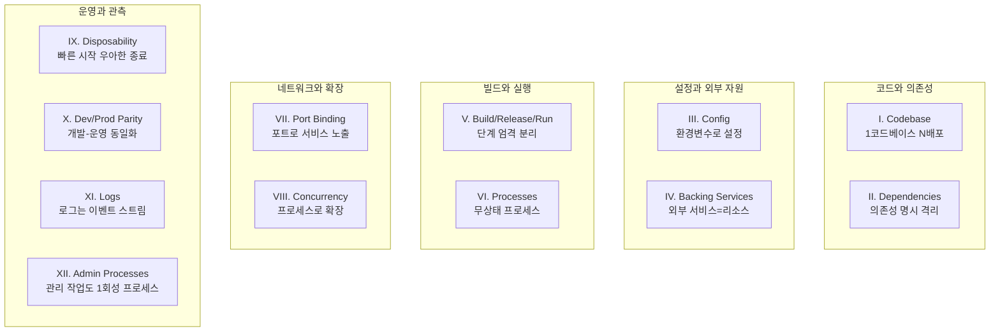
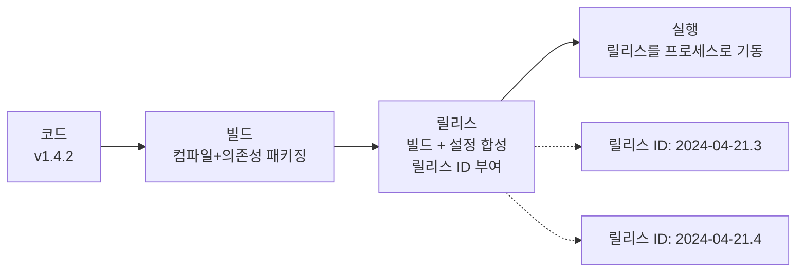

---
생성날짜:
- 2026-04-21 15:30
마지막수정날짜:
- 2026-04-21-화요일 15:30
tags:
- 설계원칙
- 앱설계원칙
- 12Factor
- 클라우드네이티브
- SaaS
- 배포
- AI에이전트
별칭:
- 12-Factor App
- Twelve-Factor App
- 12팩터
- 12-팩터 앱
type:
- 자료수집
Area/Reasource:
Project:
---
# 12-Factor App

**"클라우드 환경에 바로 올릴 수 있는 SaaS(Software as a Service, 서비스형 소프트웨어) 앱을 짓기 위한 12가지 설계 규칙 모음."**

12-Factor App(12팩터 앱, Heroku 공동창업자 Adam Wiggins가 2011년에 공개한 클라우드 배포용 애플리케이션 설계 방법론)은 환경 차이에 흔들리지 않고 수평 확장이 쉬운 앱을 만들기 위해 지켜야 할 12개의 실천 규칙이다. "포장이사 갈 때 짐 바로 옮길 수 있게 상자 표준화해 두는 것"에 비유할 수 있음. 컨테이너(Docker, Kubernetes)와 클라우드 배포가 보편화된 지금도 그대로 쓰이는 기준점.

## 한눈에 보기

| 항목 | 내용 |
| --- | --- |
| 분류 | 앱 설계 방법론(배포/운영 지향) |
| 공개 시점 | 2011년 Heroku 팀이 https://12factor.net 에 공개 |
| 대상 | 장기 실행되는 웹 서비스, API 서버, 백엔드 워커 |
| 핵심 목표 | 이식성(Portability), 재현성(Reproducibility), 수평 확장, 개발-운영 격차 최소화 |
| 구성 요소 | 12개 원칙(Codebase부터 Admin Processes까지) |
| 대표 사용처 | Heroku, AWS Elastic Beanstalk, GCP App Engine, Kubernetes Deployment |
| 포함 관계 | [[Microservices vs Monolith\|Microservices]] 설계의 기본 전제, [[API Gateway 패턴]] 뒤 각 서비스 내부 규칙, [[Event-Driven 아키텍처]]의 워커 프로세스 설계에도 적용 |

> **한마디 요약**: "환경에 상관없이 `git push` 한 번으로 돌아가게 만드는 12가지 습관."

---

## 일상 비유: 표준 규격 컨테이너 박스

이사할 때 짐을 표준 박스에 나눠 담아 두면, 이삿짐 트럭이 1톤이든 5톤이든 바로 옮겨 실을 수 있다. 12-Factor App은 앱을 "어떤 클라우드 트럭에도 실을 수 있는 표준 박스"로 포장하는 규칙임. 박스 규격, 라벨 붙이는 법, 내용물 분리 원칙까지 12가지 항목으로 정리한 체크리스트라고 보면 된다.

---

## 12가지 원칙 전체 지도



| 번호 | 이름(영문) | 한국어 | 한 줄 |
| --- | --- | --- | --- |
| I | Codebase | 코드베이스 | 저장소 하나, 배포는 여러 개 |
| II | Dependencies | 의존성 | 전부 선언하고 격리해라 |
| III | Config | 설정 | 환경변수로 뽑아내라 |
| IV | Backing Services | 백킹 서비스 | DB/큐도 갈아끼울 수 있는 부품으로 봐라 |
| V | Build, Release, Run | 빌드/릴리스/실행 | 세 단계를 섞지 마라 |
| VI | Processes | 프로세스 | 상태 없이 돌려라 |
| VII | Port Binding | 포트 바인딩 | 포트 자체 노출로 끝내라 |
| VIII | Concurrency | 동시성 | 프로세스 늘려서 확장해라 |
| IX | Disposability | 일회성 | 언제든 죽이고 살릴 수 있게 |
| X | Dev/Prod Parity | 개발-운영 동일성 | 차이를 없애라 |
| XI | Logs | 로그 | stdout 스트림으로 흘려라 |
| XII | Admin Processes | 관리 프로세스 | 마이그레이션도 같은 환경에서 한 번 돌려라 |

---

## 원칙별 상세

### I. Codebase: 1 코드베이스, N 배포

**"저장소(Repository, 코드 원본이 보관되는 장소)는 앱 하나당 정확히 하나. 개발/스테이징/운영은 그 저장소의 다른 배포일 뿐이다."**

- 같은 코드 두 번 fork 하면 12-Factor 위반
- 여러 앱이 코드를 공유해야 하면 라이브러리로 뽑아 패키지 레지스트리에 올려라
- 브랜치 전략(main/develop/feature)은 자유, 하지만 저장소 자체는 1개

```text
codebase 1개 (git remote: origin)
├── deploy: production (tag v1.4.2)
├── deploy: staging    (branch: main)
└── deploy: dev/localhost (branch: feature/x)
```

**왜**: 같은 기능 수정이 저장소 2곳에 나뉘어 있으면 운영 환경에만 버그가 남는 사고가 반복됨.

---

### II. Dependencies: 명시적 선언과 격리

**"앱이 쓰는 라이브러리와 시스템 도구를 전부 선언 파일에 적어두고, 실행 시점에는 시스템 전역 설치에 의존하지 마라."**

언어별 대응:

| 언어 | 선언 파일 | 격리 도구 |
| --- | --- | --- |
| Python | `requirements.txt`, `pyproject.toml` | venv, uv, Poetry |
| Node.js | `package.json`, `package-lock.json` | npm, pnpm + node_modules |
| Go | `go.mod`, `go.sum` | 모듈 시스템 내장 |
| Ruby | `Gemfile`, `Gemfile.lock` | Bundler |
| Rust | `Cargo.toml`, `Cargo.lock` | cargo 내장 |

```toml
# pyproject.toml (Python 예시)
[project]
dependencies = [
  "fastapi==0.115.6",
  "anthropic==0.40.0",
  "pydantic==2.10.4",
]
```

**왜**: "내 PC에서는 되는데요" 현상의 90%가 전역 설치 의존. 새 개발자가 `uv sync` 한 줄로 동일한 환경을 만들 수 있어야 한다.

---

### III. Config: 환경변수로 뽑아내기

**"환경(development/staging/production)마다 바뀌는 값은 코드 밖으로 빼서 환경변수(Environment Variable, OS가 프로세스에 주입하는 키-값 쌍)로 관리한다."**

환경변수로 빼야 할 것:
- DB 접속 정보(호스트, 포트, 비밀번호)
- 외부 API 키(ANTHROPIC_API_KEY, OPENAI_API_KEY 등)
- 기능 플래그(FEATURE_X_ENABLED)
- 공개 도메인(CANONICAL_HOST)

```python
# 나쁨: 코드에 하드코딩
API_KEY = "sk-ant-xxxxx..."
DB_HOST = "prod-db.internal"

# 좋음: 환경에서 읽기
import os
API_KEY = os.environ["ANTHROPIC_API_KEY"]
DB_HOST = os.environ["DB_HOST"]
```

`.env` 파일은 로컬 개발용 편의 도구이고, 절대 git에 커밋하지 말 것. `.gitignore`에 `.env` 추가 필수.

**직접 확인**: `git log -p | grep -i "api_key\|password\|secret"` 로 과거에 비밀값이 커밋된 적 있는지 점검할 수 있다.

---

### IV. Backing Services: 외부 자원은 갈아끼울 수 있는 부품

**"데이터베이스, 캐시, 메시지 큐, 메일 서버, 외부 API 같은 것들을 전부 '리소스'로 다룬다. URL 하나 바꾸면 로컬 MySQL에서 AWS RDS로 갈아탈 수 있어야 한다."**

| 리소스 유형 | 로컬 | 운영 | 연결 방식 |
| --- | --- | --- | --- |
| DB | SQLite 파일 | AWS RDS PostgreSQL | `DATABASE_URL` 환경변수 |
| 캐시 | 인-메모리 dict | AWS ElastiCache Redis | `REDIS_URL` |
| 객체 저장 | 로컬 디렉토리 | S3 | `S3_BUCKET`, `AWS_REGION` |
| LLM | Ollama 로컬 모델 | Anthropic API | `LLM_ENDPOINT`, `API_KEY` |

코드 관점에서 보면 "이게 같은 호스트인지 다른 호스트인지"는 전혀 신경 쓸 필요 없음. 모두 네트워크 너머의 리소스로 취급.

---

### V. Build, Release, Run: 세 단계 엄격 분리

**"코드 → 빌드 → 릴리스 → 실행 순서를 지키고, 각 단계 산출물은 불변(immutable, 한 번 만들어진 뒤 바뀌지 않음)이어야 한다."**



1단계 빌드: 소스코드 + 의존성 → 실행 가능한 번들(Docker 이미지, JAR, 바이너리)
2단계 릴리스: 빌드 산출물 + 해당 환경 설정(환경변수) → 타임스탬프 붙은 릴리스
3단계 실행: 서버가 릴리스를 프로세스로 띄움

**왜**: 실행 중인 서버에 SSH 접속해서 코드 직접 고치는 일이 생기면 롤백이 불가능해진다. 모든 변경은 새 릴리스로만.

---

### VI. Processes: 무상태 프로세스

**"앱은 하나 또는 여러 개의 stateless(무상태, 프로세스 자신이 어떤 데이터도 보유하지 않음) 프로세스로 실행된다. 상태는 전부 외부 리소스(DB, Redis)에 저장."**

금지사항:
- 로컬 디스크에 세션 파일 저장
- 프로세스 메모리에 사용자 캐시 유지
- 업로드 파일을 로컬 경로에 쌓아두기

```python
# 나쁨: 프로세스 메모리에 사용자 상태
user_sessions = {}  # 프로세스 재시작하면 날아감

@app.post("/login")
def login(user_id):
    user_sessions[user_id] = {"logged_in": True}

# 좋음: Redis에 위임
import redis
r = redis.from_url(os.environ["REDIS_URL"])

@app.post("/login")
def login(user_id):
    r.setex(f"session:{user_id}", 3600, "active")
```

**왜**: 수평 확장(인스턴스 5개로 복제) 시 어느 인스턴스가 요청을 받아도 같은 결과가 나와야 한다. Sticky Session(같은 사용자는 같은 서버로)은 임시방편일 뿐 정석은 외부 저장소.

---

### VII. Port Binding: 포트로 서비스 노출

**"앱은 외부 웹서버(Apache, Nginx)에 의존하지 않고 스스로 포트를 열어 HTTP 서비스를 제공한다. 즉 앱 자체가 웹서버를 포함."**

```python
# FastAPI 예시
if __name__ == "__main__":
    import uvicorn
    port = int(os.environ.get("PORT", 8000))
    uvicorn.run(app, host="0.0.0.0", port=port)
```

구조 변화:

| 전통 구조 | 12-Factor 구조 |
| --- | --- |
| Apache/Tomcat 안에 war 배포 | 앱 바이너리가 직접 포트 오픈 |
| 웹서버 설정과 앱 설정이 섞임 | 앱과 서버가 합쳐짐 |
| 한 서버에 여러 앱 배포 | 한 프로세스당 한 포트 |

리버스 프록시(Nginx, AWS ALB)는 여전히 쓰이지만, 앱 앞단에서 라우팅·TLS 종단용일 뿐 앱 실행 주체는 아님.

---

### VIII. Concurrency: 프로세스로 확장

**"CPU 바운드, I/O 바운드, 백그라운드 작업 등 유형별로 프로세스를 나누고, 부하가 늘면 프로세스 개수를 늘려 확장한다."**

Heroku의 Procfile 원형:

```procfile
# Procfile
web: gunicorn app:app -w 4
worker: python jobs/worker.py
scheduler: python jobs/cron.py
```

- web 프로세스: HTTP 요청 처리
- worker 프로세스: 비동기 큐 작업
- scheduler 프로세스: 주기 실행 작업

부하 2배 → 각 프로세스 타입 개수 2배. 스레드/쓰레드풀 튜닝으로 수직 확장하는 것보다 프로세스 복제로 수평 확장하는 게 우선.

Kubernetes에서는 Deployment의 `replicas` 값이 동일한 역할을 한다.

---

### IX. Disposability: 빠른 시작, 우아한 종료

**"프로세스는 언제든 죽고 다시 살아날 수 있다는 전제로 짠다. 시작은 수 초 내에, 종료는 SIGTERM 받으면 진행 중 작업 마무리 후 깔끔하게."**

| 지켜야 할 것 | 설명 |
| --- | --- |
| 빠른 시작 | 프로세스 시작 후 요청 받기까지 수 초 이내. JVM 워밍업 오래 걸리는 건 GraalVM 네이티브 이미지로 대응 |
| Graceful shutdown | SIGTERM 수신 → 새 요청 거부 → 진행 중 요청 완료 대기 → 종료 |
| 멱등한 작업 | worker가 처리 중 죽어도 다시 큐에서 꺼내 재실행 가능해야 함 |

```python
# FastAPI lifespan으로 우아한 종료
from contextlib import asynccontextmanager

@asynccontextmanager
async def lifespan(app):
    yield
    await db_pool.close()  # 종료 시 연결 정리
    await llm_client.aclose()

app = FastAPI(lifespan=lifespan)
```

**왜**: 클라우드는 스팟 인스턴스 회수, 스케일 다운, 배포 롤링 업데이트 등으로 프로세스가 수시로 죽는다. "예고 없이 죽어도 문제없음"이 기본 전제.

---

### X. Dev/Prod Parity: 개발과 운영 격차 최소화

**"개발 환경과 운영 환경의 차이를 시간/인력/도구 세 축에서 모두 좁힌다."**

| 격차 | 전통 방식 | 12-Factor 방식 |
| --- | --- | --- |
| 시간 차이 | 개발 후 배포까지 몇 주 | 몇 시간 이내 CI/CD |
| 인력 차이 | 개발자와 운영자 분리 | 개발자가 배포까지 책임(DevOps) |
| 도구 차이 | 로컬 SQLite, 운영 Oracle | 로컬도 동일 DB 엔진(Docker Compose로 PostgreSQL) |

도구 차이는 특히 중요: 로컬에서 SQLite 쓰고 운영에서 PostgreSQL 쓰면, SQL 방언 차이로 운영에서만 터지는 버그가 생긴다.

```yaml
# docker-compose.yml 로컬 개발
services:
  db:
    image: postgres:16
    environment:
      POSTGRES_PASSWORD: dev
  redis:
    image: redis:7
```

---

### XI. Logs: 로그는 이벤트 스트림

**"앱은 로그를 파일이나 로그 서비스에 직접 쓰지 않고, stdout(표준 출력)에 한 줄씩 찍기만 한다. 수집/저장/분석은 바깥 인프라가 담당."**

```python
# 나쁨: 앱이 직접 파일 관리
logging.basicConfig(filename="/var/log/myapp.log")  # 회전, 압축 전부 앱 책임

# 좋음: stdout으로만
import logging
logging.basicConfig(
    level=logging.INFO,
    format='%(asctime)s %(levelname)s %(name)s %(message)s',
    handlers=[logging.StreamHandler()]  # stdout 하나면 끝
)
logger = logging.getLogger(__name__)
logger.info("user.login", extra={"user_id": 123})
```

로그 흐름:

```text
앱 stdout → 컨테이너 런타임 → 수집기(Fluentd/Vector) → 저장소(S3/Elasticsearch) → 조회 UI(Kibana/Loki)
```

**왜**: 앱이 파일 회전·압축·원격 전송까지 하려면 코드가 복잡해지고 디스크 가득 차면 앱이 죽는다. 관심사를 분리하라는 [[#코딩 원칙]] 원칙의 구체적 적용.

---

### XII. Admin Processes: 관리 작업도 1회성 프로세스

**"DB 마이그레이션, 데이터 백필, REPL 접속 같은 관리 작업도 앱과 똑같은 코드베이스·환경·의존성으로 실행한다."**

| 작업 | 어떻게 |
| --- | --- |
| DB 마이그레이션 | `python manage.py migrate` (앱 컨테이너에서 1회성 실행) |
| 데이터 백필 스크립트 | `python scripts/backfill.py` (같은 Docker 이미지로 kubectl run) |
| REPL 디버깅 | `python manage.py shell_plus` (같은 환경변수로 접속) |

금지사항:
- 운영 DB에 직접 SQL 붙어서 손으로 UPDATE 날리기
- 로컬 PC에서만 돌리는 파이썬 스크립트로 운영 데이터 변경
- 앱 코드와 버전이 다른 스크립트 사용

Kubernetes 예시:

```bash
kubectl run migration --image=myapp:v1.4.2 \
  --env-from=secret/myapp-env \
  --restart=Never \
  -- python manage.py migrate
```

앱이 쓰는 이미지, 환경변수, 의존성 그대로 사용.

---

## 나쁜 예 vs 좋은 예 (전체 스냅샷)

### 나쁜 예: 12-Factor 무시

```python
# app.py
API_KEY = "sk-ant-real-key-xxx"  # III 위반: 코드에 하드코딩
DB_FILE = "/home/ubuntu/app/data.db"  # IV, VI 위반: 로컬 파일 의존

sessions = {}  # VI 위반: 프로세스 메모리 상태

def handle_login(user):
    sessions[user] = datetime.now()
    with open("/var/log/myapp.log", "a") as f:  # XI 위반: 파일 직접 쓰기
        f.write(f"login {user}\n")

# 배포: FTP로 서버에 코드 올리고, 서버에서 pip install 한 줄씩 실행 (I, II, V 위반)
```

### 좋은 예: 12-Factor 준수

```python
# app.py
import os, logging, redis
from fastapi import FastAPI

logging.basicConfig(level=logging.INFO, handlers=[logging.StreamHandler()])  # XI
log = logging.getLogger(__name__)

app = FastAPI()
r = redis.from_url(os.environ["REDIS_URL"])  # III, IV, VI
API_KEY = os.environ["ANTHROPIC_API_KEY"]  # III

@app.post("/login")
def login(user: str):
    r.setex(f"session:{user}", 3600, "active")  # VI
    log.info("user.login", extra={"user": user})  # XI
    return {"ok": True}

if __name__ == "__main__":
    import uvicorn
    uvicorn.run(app, host="0.0.0.0", port=int(os.environ["PORT"]))  # VII
```

```dockerfile
# Dockerfile (II, V)
FROM python:3.12-slim
WORKDIR /app
COPY pyproject.toml uv.lock ./
RUN pip install uv && uv sync --frozen
COPY . .
CMD ["python", "app.py"]
```

```procfile
# Procfile (VIII)
web: python app.py
worker: python worker.py
```

---

## AI 에이전트 개발에서의 12-Factor

AI Agent 백엔드는 12-Factor가 특히 잘 맞는다. LLM 키 관리, 프롬프트 버전, 도구 서버 분리, 백그라운드 작업 같은 요소가 원칙과 1:1 매칭됨.

| 원칙 | AI Agent에서 구체적으로 |
| --- | --- |
| III. Config | `ANTHROPIC_API_KEY`, `MODEL_NAME`, `MAX_TOKENS`, `SYSTEM_PROMPT_VERSION` 전부 환경변수 |
| IV. Backing Services | LLM 엔드포인트(Anthropic/OpenAI/Ollama), Vector DB(Pinecone/Qdrant), Tool 서버(MCP) 전부 URL로 교체 가능 |
| V. Build/Release/Run | Docker 이미지에 프롬프트 템플릿 포함, 릴리스마다 프롬프트 버전 고정 |
| VI. Processes | 세션 대화 기록은 Redis/PostgreSQL, 에이전트 프로세스 자체는 무상태 |
| VIII. Concurrency | web(채팅 API), worker(긴 Tool 호출), scheduler(주기 평가) 프로세스 분리 |
| IX. Disposability | LLM 호출 도중 죽어도 재시도 가능하도록 idempotency key(멱등 키, 같은 요청을 여러 번 보내도 결과가 한 번인 것처럼 처리되게 하는 식별자) |
| XI. Logs | 프롬프트 + 응답 + 토큰 사용량을 structured log로 stdout에, [[Langfuse-doc|Langfuse]] 같은 관측 도구로 수집 |

**실전 체크리스트**:
- [ ] `.env.example` 파일을 깃에 커밋(실제 `.env`는 제외), 새 팀원이 보고 바로 세팅 가능
- [ ] `docker compose up` 한 줄로 로컬 환경 구동(LLM은 로컬 Ollama 또는 API mock)
- [ ] DB 마이그레이션은 Alembic으로 관리, 앱 배포 파이프라인 안에서 실행
- [ ] 프롬프트 템플릿은 코드베이스 안의 파일(`prompts/*.md`)로, 외부 시스템에서 런타임에 로드하지 말 것

---

## 트레이드오프

| 장점 | 단점 |
| --- | --- |
| 어느 클라우드·컨테이너 환경에도 이식 가능 | 초기에 설정과 인프라 학습 비용 |
| 수평 확장이 자연스러움 | 레거시 앱에 소급 적용은 어려움 |
| 개발-운영 격차가 좁아 버그 재현 쉬움 | 단순 스크립트/CLI에는 과잉 설계 |
| 12개 항목이 구체적 체크리스트 역할 | 데이터 인텐시브(대용량 ETL) 워크로드는 무상태 원칙과 충돌 |
| 컨테이너/Kubernetes와 궁합 최상 | 파일 기반 레거시 기능(로컬 업로드 저장)은 재설계 필요 |

**주의**: 12-Factor는 "장기 실행 웹/워커 서비스"에 최적화된 규칙이다. 배치 파이프라인, 빅데이터 처리, GPU 훈련 잡처럼 대량 상태를 다루는 작업에는 변형이 필요.

---

## 언제 쓰면 좋은가 / 피해야 할 때

**좋을 때**:
- 클라우드(AWS/GCP/Azure)나 Kubernetes에 배포하는 서비스
- 다인 팀이 개발하는 웹 API, SaaS, AI 백엔드
- 개발-스테이징-운영 환경을 구분해 운영하는 모든 앱

**피해야 할 때**:
- 1회성 실행 스크립트(cron으로 한 번 돌리고 끝)
- 데스크톱 애플리케이션, 모바일 앱 자체(서버 백엔드는 해당)
- 커널/드라이버 같은 시스템 소프트웨어
- HPC(High Performance Computing, 고성능 연산) 워크로드처럼 상태 기반 최적화가 필수인 작업

---

## 직접 확인하기

1. 공식 사이트 정독: https://12factor.net (한국어 번역본도 있음: https://12factor.net/ko/)
2. 자기 프로젝트 루트에서 다음 명령으로 위반 요소 탐색

   ```bash
   # III 위반: 코드에 비밀값 박혀 있는지
   grep -rE "(api_key|password|secret|token)\s*=\s*['\"]" --include="*.py" .

   # VI 위반: 전역 변수 상태 사용
   grep -rE "^(sessions|cache|users|state)\s*=\s*\{\}" --include="*.py" .

   # XI 위반: 파일에 로그 직접 기록
   grep -rE "FileHandler|filename=.*\.log" --include="*.py" .
   ```

3. `docker build` + `docker run -e` 조합만으로 앱이 돌아가는지 확인. 호스트 PC 특정 경로에 의존하면 실패함
4. 앱 실행 중 `docker kill --signal=SIGTERM` 후 로그 확인: 진행 중 요청이 정상 마무리되는지(IX 점검)
5. Heroku 무료 플랜 또는 Railway/Render 같은 PaaS에 `git push` 한 번으로 배포해 보기(12-Factor 준수 여부가 즉시 드러남)

---

## 관련 패턴과의 포함 관계

- **[[Microservices vs Monolith|Microservices]]의 전제조건**: 각 서비스가 12-Factor를 지켜야 독립 배포·확장이 가능
- **[[API Gateway 패턴]]과 조합**: Gateway 뒤 각 서비스가 12-Factor App 구조
- **[[MVC 패턴]]의 상위 개념**: MVC는 앱 내부 구조, 12-Factor는 앱과 외부 환경의 관계
- **[[Event-Driven 아키텍처]]의 워커 프로세스**: VI(무상태), VIII(동시성), IX(일회성) 원칙이 그대로 적용
- **[[Pipeline 아키텍처]]의 스테이지 분리**: V(Build/Release/Run)가 CI/CD 파이프라인 설계의 기반
- **[[Orchestrator-Worker 아키텍처]]**: worker 프로세스 타입이 VIII(Concurrency) 원칙의 직접 적용
- **컨테이너(Docker)와 궁합**: 12-Factor 전 항목이 Dockerfile + 환경변수 + 오케스트레이터로 자연스럽게 구현됨

---

## 파생/후속 논의

- **Beyond the Twelve-Factor App (Kevin Hoffman, 2016)**: 15-Factor로 확장, API First, Telemetry, Authentication and Authorization 등 추가
- **Cloud Native Application (CNCF 정의)**: 12-Factor + 컨테이너화 + 오케스트레이션 + 마이크로서비스 + DevOps 조합
- **Serverless 관점**: AWS Lambda 같은 환경은 VI(무상태), IX(일회성)이 강제됨. 12-Factor가 이미 내장된 실행 모델

---

## 요약

> **"코드베이스 하나, 의존성 명시, 설정은 환경변수, 외부 자원은 리소스, 빌드/실행 분리, 무상태 프로세스, 포트 바인딩, 프로세스 확장, 일회성, 개발-운영 동일성, stdout 로그, 관리 작업도 같은 환경. 이 12개를 지키면 어느 클라우드에든 `git push`로 올라간다."**

관련 문서:
- [[코딩 앱 설계 원칙_index]]
- [[Microservices vs Monolith]]
- [[API Gateway 패턴]]
- [[Event-Driven 아키텍처]]
- [[Pipeline 아키텍처]]
- [[Orchestrator-Worker 아키텍처]]
